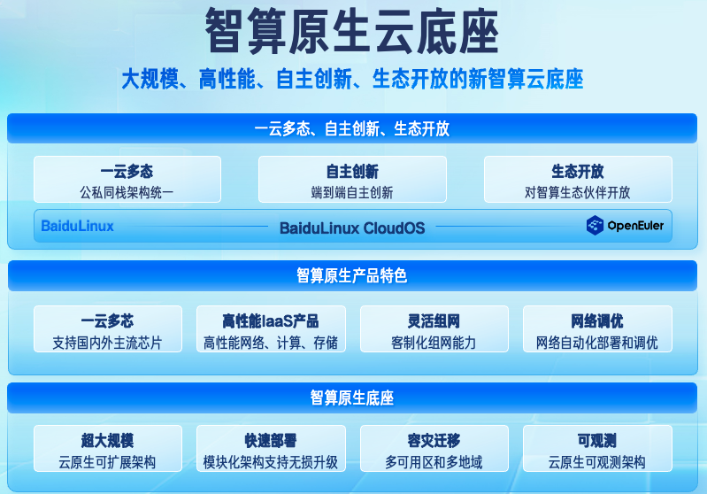

**[应用背景]**

BaiduLinux Cloud
OS是百度公司基于openEuler自主构建的一款高性能操作系统。该系统不仅深度服务于百度的内部业务，同时也广泛支持百度外部客户的多样化需求。

**[业务需求]**

作为一款面向云底座、云原生、AI平台和应用的AI原生操作系统，BaiduLinux
Cloud OS旨在为用户提供更加高效、稳定、安全的运行环境。

**[解决方案]**

BaiduLinux
CloudOS致力于打造卓越性能、广泛兼容的自主创新操作系统，可满足用户在其所需环境上搭建一套与公有云能力完全一致的云底座，确保在系统运行和运营维护时的可靠性和可控性，为基础设施自主创新之路打下坚实基础。

1.  **稳定可靠，安全合规**：BaiduLinux CloudOS
    具备对代码的完整掌控能力，任何可能在运行过程中出现的安全风险以及产品的安全漏洞，百度可以及时进行评估和修复。同时，BaiduLinux
    完全兼容主流系操作系统的软件包和操作习惯，降低了用户的迁移成本和学习难度，为后续可能的技术迭代和架构更替铺平道路。

2.  **性能卓越，体验升级**：针对政企客户的关键业务需求，BaiduLinux
    CloudOS 搭载了百度自研的第三代操作系统内核，通过多项技术创新，如 CPU
    离线调度与编排、NUMA 亲和进程管理、Cache
    预取智能调优以及编译器自动向量化编译等，显著提升了操作系统性能。特别是对离在线混部业务场景，BaiduLinux
    CloudOS 大幅提高了 CPU 资源利用率。随着对新一代 CPU
    特性的引入，BaiduLinux CloudOS 可为用户带来更加出色的性能、能效、AI
    处理能力和图形处理能力。

3.  **多形态云环境纳管与优化**：BaiduLinux CloudOS
    广泛兼容各类底层芯片，包括
    Intel、AMD、鲲鹏、海光等芯片处理器架构，以及
    NVIDIA、昇腾、昆仑芯等主流 AI
    处理器，是百度智能云为满足不同场景对算力的差异化需求所构建的智算云操作系统。

4.  **生态开放，智算原生**：面对大模型时代「 AI
    原生应用」需求，BaiduLinux CloudOS 内置了「 AI
    工作环境」所需的驱动、开发库和管理软件等，为 AI
    工作者提供了开箱即用的开发体验。

**[客户价值]**

百度与 openEuler
社区已紧密合作多年，百度智能云在丰富的社区资源和工具中受益颇深。BaiduLinux
CloudOS正是在 openEuler 5.10 内核的基础上，融入了丰富的 BaiduLinux
特性，并已将关键 kernel 特性贡献至 openEuler 6.6 内核中，进一步增强了
openEuler 的能力。

凭借在商用化领域的深厚积累和实践经验，BaiduLinux
已在核心业务场景实现了规模化部署。百度期待将这些久经客户验证的产品能力，与更多openEuler社区的伙伴共享，推动
openEuler
在更多场景的应用，助力产业生态实现创新方案的落地，共同推进数字化转型的进程。
