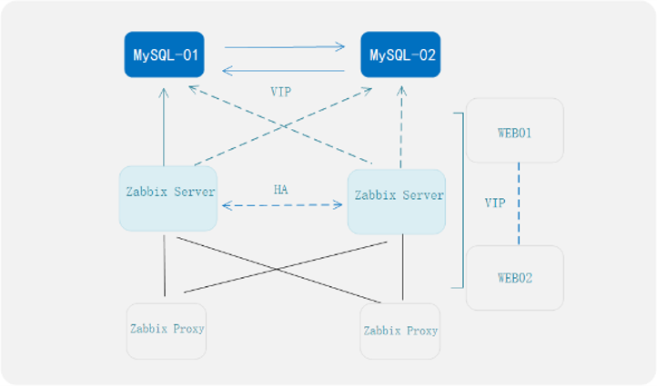

## 应用场景

滨州医学院烟台附属医院是一家省属大型三级甲等综合医院，随着医疗信息化不断的发展，IT资产管理数量越来越庞大，医院核心业务运行对信息化有着较高依赖度，系统之间缺乏一体化监控管理平台，各类系统太离散，运维效率不高，如何有效的对资产状态进行监测保障核心业务稳定运行尤为重要。

## 解决方案

- 基于X86服务器使用openEuler 22.03 SP1 操作系统构建事件监测平台底座。

- Zabbix 统一运维事件监测平台，前端使用Nginx+Keepalived 实现Web 高可用，后端存储采用MySQL 双主构建高可用集群，通过对Linux、Windows、网络设备 、安全设备、服务器IPMI 、传感器 、虚拟化、数据库、中间件等节点纳管实现资源的统一监测和管理，发现异常事件够快速定位并解决 IT 系统问题。

- 部署架构: 采用 Server-Proxy-Agent  分布式部署，由 Agent 负责监控数据的采集，通过 Proxy 定期将监控数据发送给 Server 端，通过 Web 界面进行统一管理。

## 客户价值

基于openEuler 22.03 SP1操作系统结合统一运维事件监测平台有效的支撑医疗信息化平稳运行，对发生的异常事件能够及时发现告警并能快速定位异常事件，大大降低了系统宕机时间，提升 IT 运维服务质量和效率。

