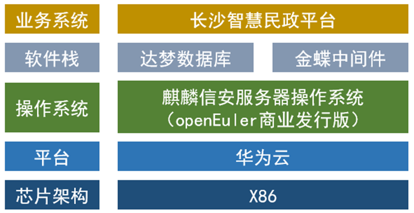

## 应用场景

长沙市民政局智慧民政平台核心功能主要为便民业务的开展，拓宽老年人、残疾人业务申请的渠道，系统均部署在政务云上。因CentOS修改相关开源及维护策略，原有业务系统面临着系统安全漏洞风险、系统瘫痪等隐患，需将底层所采用的CentOS操作系统替换成一种安全、稳定、长期维护的基于国内根社区开发的国产操作系统。经过麒麟信安全新改造，将业务系统平滑迁移至麒麟信安服务器操作系统(openEuler商业发行版)。

## 解决方案

- 业务系统：长沙智慧民政平台系统

- 软件栈：达梦数据库、金蝶中间件

- 操作系统：麒麟信安服务器操作系统

## 客户价值

在业务系统改造过程中，将其整合为统一的智慧民政平台，并将底层的CentOS替换为国产操作系统上，安全性上得到了保障，解决了客户可能面临的系统安全漏洞风险、系统瘫痪等痛点问题，推动了基层民政信息化服务的建设，为党政人员办公提供了便利，促进了便民业务的开展，对党政行业政务系统建设具有示范作用。

## 伙伴

