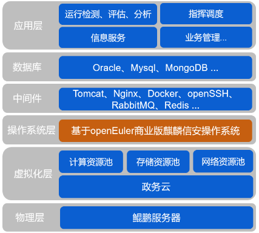
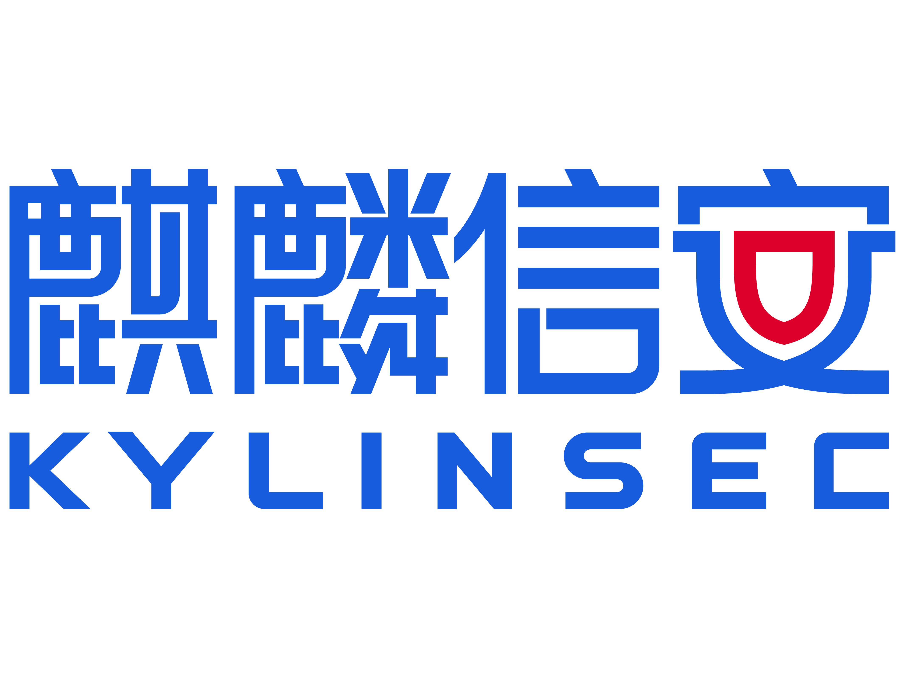

**应用背景**

长沙市智慧交通发展中心围绕综合交通运输协调体系的构建，实施交通运行的监测、预测和预警，面向公众提供交通信息服务，开展多种运输方式的调度协调，提供交通行政管理和应急处置的信息保障。

目前其各类业务系统部署在政务云的虚拟服务器上，服务器操作系统采用CentOS7，由于2024年6月30日CentOS7面临停服，将无法获得官方升级和补丁，一旦发现新的安全漏洞，很容易被恶意攻击者利用，承载用户关键业务的服务器可能面临服务中断、数据泄露等风险，数据安全性将无法得到保障。针对此现状，长沙市智慧交通发展中心亟需将现有操作系统升级为自主创新、安全稳定可靠的国内操作系统，麒麟信安作为国内服务器操作系统第一梯队厂商，为用户提供国内服务器操作系统和系统迁移及加固相关解决方案。

**解决方案**

-   服务器操作系统采用基于openEurer的商业版麒麟信安操作系统；

-   采用麒麟信安自研的一键式迁移工具C2K，能实现自动化系统迁移，提升迁移效率，降低人为操作风险；

-   在系统迁移前，湖南欧拉生态创新中心对长沙市智慧交通发展中心业务软件进行兼容适配测试，确保迁移后业务软件的正常运行；

-   提供端到端的"迁移规划-\>方案设计-\>方案验证-\>迁移实施-\>上线运行"等全流程系统迁移服务和原厂售后服务。

**客户价值**

-   通过将用户现有的服务器操作系统升级为麒麟信安操作系统，有效避免了操作系统停服对用户业务系统的稳定运行产生的影响，确保了用户业务系统的持续性，同时为用户提供了安全、稳定、可靠的国产操作系统服务；

-   在交通行业采用基于openEurer的商业版麒麟信安操作系统，不仅验证了交通行业应用软件能稳定运行在openEuler商业版操作系统之上，更进一步推动了交通行业基础软件的自主创新和
    openEuler 社区生态的建设；

-   麒麟信安作为湖湘本土的操作系统厂商能快速响应客户的业务需求，提供全天候的原厂售后支持服务，高效保障了用户业务系统安全稳定运行。

**合作伙伴**

