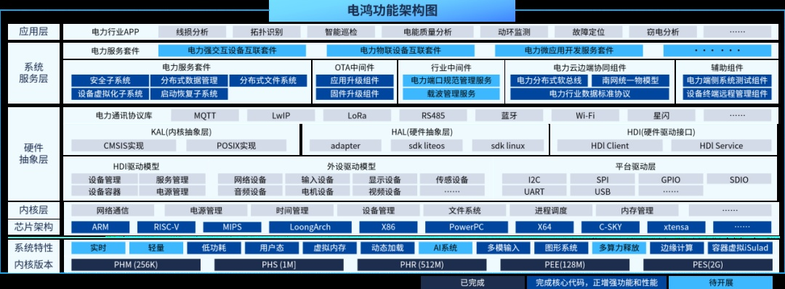

**应用背景**

随着新型电力系统加速建设，大规模新能源、分布式光储充、海量智能物联终端和控制元件接入电网，电网成为典型的广域分布式工业互联网。电力系统数据格式七国八制，难以统一管理，无法满足海量终端高效管理、配网运行高度透明的需要。同时，电网设备类型繁多，系统相互独立，设备运维工作需前往现场进行，耗费大量时间奔波，并存在安全风险，给设备的管理和维护带来了极大的挑战。

**解决方案**

电鸿是以OpenAtom OpenHarmony和OpenAtom
openEuler为底座，结合电力终端特性，在开源体系下定制开发电力统一物联操作系统。电鸿具有以下六大技术特点：统一模型：内置电力和能源行业主流通信规约与模型；敏捷连接：实现近场通信总线和云边协同连接；弹性解耦：实现系统及行业组件弹性化、模块化的解耦架构；全栈可信：满足EAL
5+认证，支持电力端、边、云信任链认证；多核融合：满足电力强实时、极简超微、高性能高可靠要求内核混合部署；纯净底座：电鸿具有开放共享、联合开发、敏捷开发和多段部署的特性。

**业务价值**

1.社会层面：电鸿打造端管云协同的开放平台，并发布开放架构和生态；

2.行业层面：电鸿构建电力行业边端统一操作系统，并构建基于云边端架构的行业生态；

3.安全层面：电鸿实现安全统一规约、统一协议和数据统一治理；

4.业务层面：电鸿实现输变配"融合终端+传感器"的即插即用，赋能数字生产，实现巡检少人化、无人化，并支撑海量终端运维，快速升级。
