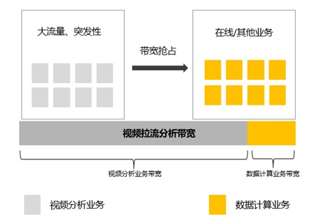
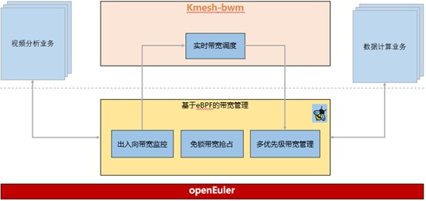
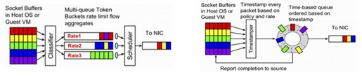
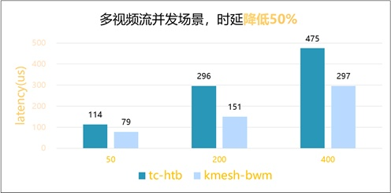

**应用背景**

浙江大华技术股份有限公司（以下简称：大华股份），是全球领先的以视频为核心的智慧物联解决方案提供商和运营服务商。作为物联数智平台的重要组成部分，大华股份容器云平台作为视图大数据底座，同时支撑视图智能和城市业务的云化输出以及公司AI训练业务的开展。面对复杂多样的云上负载以及异构硬件算力，容器云平台发挥统一管理，资源池化调度，应用编排的云平台技术优势，提升基础设施管理使用效率。结合负载及行业特点，大华在私有化交付运维，云和大数据融合调度，异构算力调度等场景做针对性的优化迭代。**业务挑战**业务负载层面，视频混合部署的场景面临着大流量和突发流量的挑战。这些突发流量会抢占在线业务带宽，导致在线业务的网络质量（QoS）受到影响。容器混部层面，在业务声明资源要求和QoS后，容器云会在统一资源池上进行管理调度。业务并不是静态分布在固定的专属服务器上，考虑到网络QoS的影响，这种场景限制了容器部署密度，且资源的随机分布相比以前还引入了不稳定因素，资源未能得到充分利用。私有化交付层面，服务器利旧以及现有物理机方案平替的场景是核心场景之一，让云化交付不给现场带来心理负担和方案改造门槛是我们的关注点，因此通过各类资源的大量冗余来规避上述问题不可行。例如下图中，当大流量、突发性的视频分析业务运行时，此类业务将抢占原本在线业务的带宽，造成在线业务处理的时延升高，甚至业务异常。因此如何在确保业务稳定运行的同时，充分释放硬件资源，成为当前亟待解决的关键问题。

**解决方案**

性能问题的根本原因在于 tc htb 带宽管理方案的核心依赖于
htb，该技术使用单一队列，导致全局锁竞争。随着流量的增加，全局锁的开销显著上升，最终无法满足高并发业务场景的需求。如何降低时延、提升容器部署密度并合理利用硬件资源，成为提升产品竞争力的关键挑战。为应对这一问题，大华股份在多视频流混合部署场景中，联合
openEuler 社区Kmesh
团队，深入研究并优化带宽管理方案，特别是在容器高密度部署方面进行技术突破。通过引入
Kmesh-bwm（Kmesh 带宽管理），利用eBPF
技术进行操作系统层面的优化，成功解决了原有方案中的性能瓶颈，大幅提升了容器部署密度和资源利用率。整体架构图如下所示：

**具体优化技术包括：**

1、出入方向带宽监控：支持对流量方向的精细化处理，提供更灵活的带宽管理。出方向经过主机网卡进行转发，入方向增加了ifb设备用来重定向主机网卡的流量。

2、免锁带宽抢占：利用 eBPF 和 EDT
机制，为每个数据包（skb）标记最早离开时间，并使用时间轮转器替代原有的出向缓冲队列，解决了原生方案中单队列锁竞争的问题。下图是基于
queue
的流量整形器和基于EDT的流量整形器的对比，左图中的流量都会在出向缓冲队列（qdisc
queue）排队，并按照顺序通过qdisc发送。qdisc根据设定的速率决定何时从队列中取出数据包并发送，当流量过大的时候，单个队列会导致过高的延迟和丢包率。右图是基于EDT的流量整形器。eBPF程序会为每个包（skb）打上一个最早可以发送的时间戳；用时间轮调度器替换原来的qdisc，可以缓解锁竞争问题

 3、多优先级带宽管理：包括最低带宽保障和富余带宽再分配，具体优化策略如下：

> 最低带宽保障：确保每个 Pod
> 获取所需的最低带宽，避免突发流量抢占在线业务带宽，从而确保在线业务的
> QoS 不受影响。
>
> 流量优先级管理：按照三种优先级对流量进行管理，流量的分配按优先级从高到低进行。
>
> 富余带宽再分配：当所有流量的最低带宽需求已得到满足后，节点上若有富余带宽，将根据优先级比例进行再分配，相同优先级的流量将均分剩余带宽。

**客户价值**

借助 Kmesh-bwm
带宽管理方案，在视频流多业务并发场景下取得了显著优化：时延降低超过50%且在业务负载加载后波动低；容器部署密度在前述场景下提升超过50%且密度只和pod数相关，产品规格不受Pod业务形态影响，整体资源利用率节省了30%。

