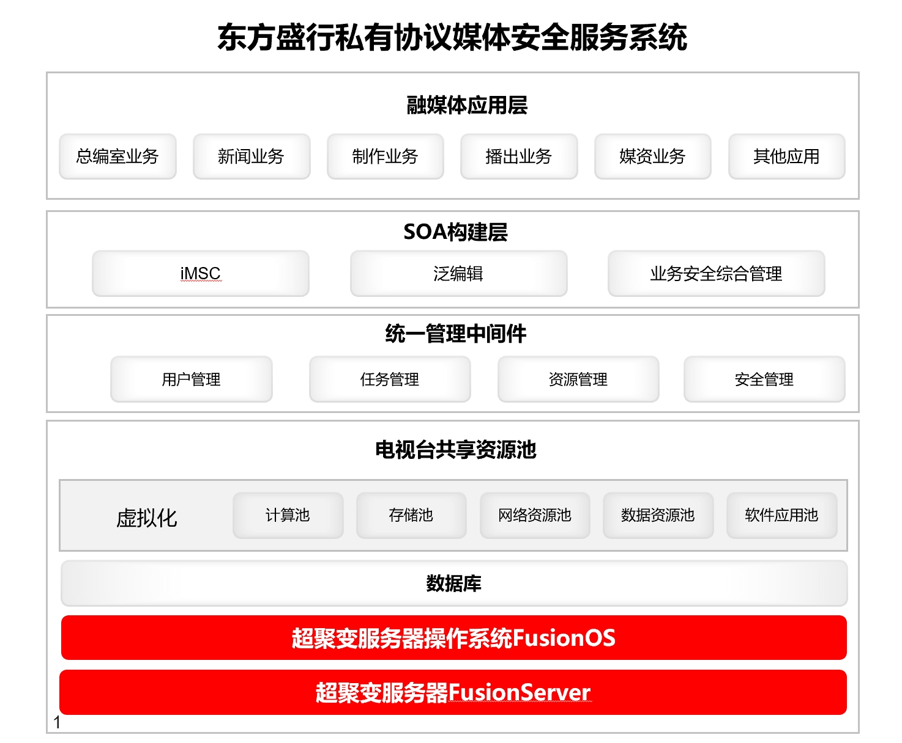

## 应用场景

东方盛行电子有限责任公司是专业从事数字视音频软硬件开发的高科技企业，作为国内广电行业提供总体解决方案的专业设计和咨询服务的厂商，曾多次为国内多家电视台提供高难度、超复杂的设计、生产、施工综合项目。东方盛行的PMSC私有协议媒体安全服务系统为了更好应对网络病毒、数据交互等安全性威胁及满足广电行业内容高频互传的诉求，需要进一步提高该传输平台安全级别和数据处理能力。同时，应广电行业要求东方盛行需要逐步完成操作系统的国产化替换工作，进一步保障广电行业的信息安全。

## 解决方案

- 操作系统选择超聚变操作系统FusionOS，硬件采用超聚变服务器FusionServer作为算力底座。

- 面向场景的性能优化，实现平台更好支持视频处理、图片OCR识别、samba拷贝、数据传输等功能。

- 通过安全加固工具对FusinOS全面配置加固，同时对接FusionOS监控告警框架，实现对OS资源的实时监控。

- 针对广电行业的非编软件高效完成了兼容性适配，保障客户业务稳定运行。

## 客户价值

- 打造具备高安全性、高效率、高可靠的PMSC私有协议媒体安全服务系统，支持多种云环境数据安全交互模式，多条私有传输链路的热备部署、并行部署、自动负载均衡，支持数据定制加密处理;

- 针对内核CIFS协议做深度调优，实现拷贝性能提升2倍，拷贝速度由450MB/S到1200MB/S，解决了高频互传对拷贝速度的关键诉求。

- 实现核心业务操作系统国产化替换和创新，为企业业务全面替换提供模范效应。