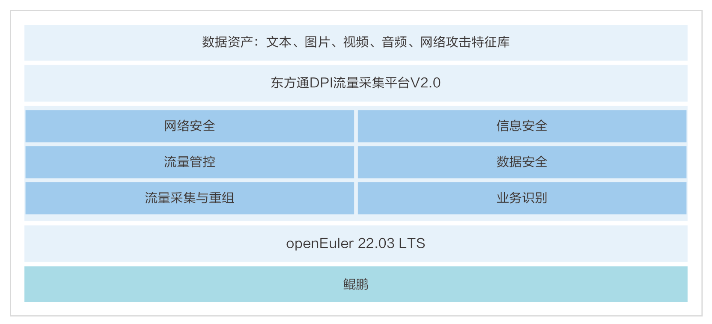

## 应用场景

在数字化时代，网络安全和信息安全至关重要。东方通科技有限公司针对网络流量监控和数据安全需求，开发了基于openEuler操作系统的DPI流量采集平台V2.0，以确保网络环境的安全和高效运行。

## 解决方案

东方通DPI流量采集平台V2.0的解决方案特点如下：

- 全栈优化：利用openEuler操作系统的特性，结合鲲鹏BoostKit和鲲鹏DevKit，对DPI产品进行了全栈优化，确保了平台的高性能和稳定性。

- 功能全面：平台具备数据流向分析统计、协议及业务识别、业务质量分析、网络及数据安全监测、图片文本还原、串并接控制等多功能，满足不同网络环境的数据采集需求。

- 智能化处理：通过智能化技术，平台能够自动发现网络中的信息安全风险、数据安全风险、网络安全风险以及网络服务质量等问题。

- 综合解决方案：为网络运维提供了一个全方位的数据+、安全+、智慧+的综合解决方案，帮助企业及时发现并应对各种网络风险。

## 客户价值

- 提升效率和安全性：通过结合openEuler操作系统的优势，为用户提供了一个高性能、自动化、智能化的网络流量监控和数据安全解决方案，提升了网络运维的效率和安全性

- 自主创新：平台采用全自研技术架构，无第三方依赖，体现了自主创新的优势，简化了部署过程。

- 高性能保障：利用鲲鹏硬件的强大处理能力，单台设备处理流量可达每秒200Gb，显著提升了数据处理效率。

- 业务可拓展性：平台具备强大的业务水平拓展能力，能够在拓展新特性的同时保持向下兼容性，确保了长期的业务发展和技术迭代

