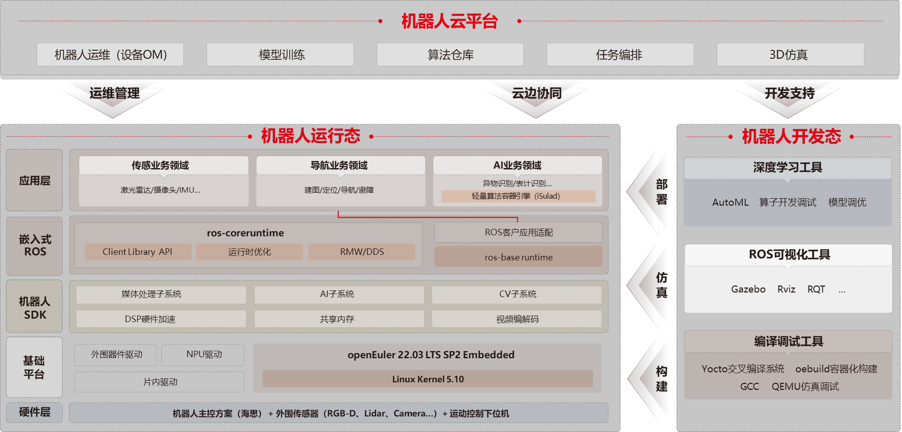

## 应用场景

在变/配电站场景下，通过智能感知、智慧视觉等能力，结合轮式机器人，实现自动化的例行巡检、专项巡检、特殊巡检、自定义巡检以及人工遥控巡检等功能。

## 业务挑战

- 机器人所使用的嵌入式系统不同于一般的服务器系统，有系统资源、功耗、可靠性等方面的限制；

- 基于客户场景，在电压、电流、脉冲信息采集方面有较高的实时性要求；

- 不同地区的变/配电站在实际建设过程中所遵循的标准和要求有所不同，因此在实际使用过程中不同地区使用的应用也有所区别。应用和机器人不能绑定，需要做到灵活部署和动态升级；

## 解决方案

鼎桥基于arm架构和openEuler Embedded，针对不同场景进行定制化裁剪，基于混合关键部署系统，同时部署实时操作系统和非实时操作系统，并根据业务的实时性要求划分到不同的操作系统中运行以达成关键业务的实时性要求，满足不同场景和地区应用定制化的诉求。

## 客户价值

- 通过实时操作系统实现了良好的实时性，在7*24小时不间断运行中，最大中断时延未超过客户要求的时延；

- 使用容器分层部署硬件SDK、AI框架和应用层软件，使各组件可以独立开发和维护，大幅减少后续的开发和运维成本；

- 系统既具备Linux丰富的生态和管理能力，又满足高实时、高可靠、高安全的要求，为后续客户业务的拓展提供了更多的可能。

