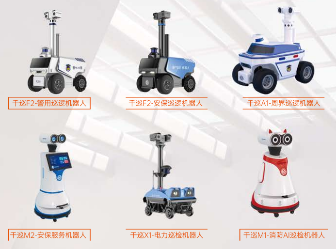
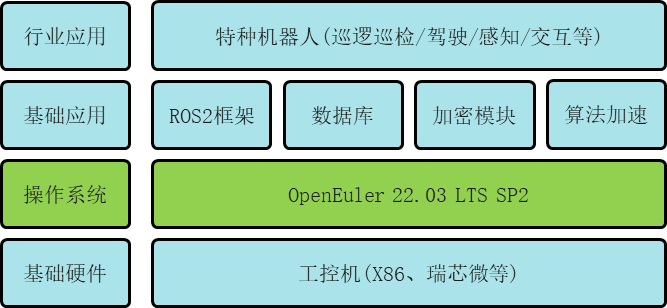

## 用户背景

广州高新兴机器人有限公司是全球领先的巡逻机器人产品与服务提供商。聚焦安保巡逻机器人领域，产品已广泛应用于公安、企业园区、地产物业等场景。巡逻机器人是综合采用人工智能、物联网、云计算等技术，集成环境感知、动态决策、行为控制和报警装置，具备自主感知、自主行走、自主保护等能力的多功能智能装备。可以帮助人类完成基础性、重复性和危险性的安保工作，推动公共安全服务升级，提升安全效果和降低安保服务成本等。

高新兴机器人秉持提升产品竞争力的目标，在产品软硬件采用多元化供应的策略。一方面识别选用有竞争力的供应商，提前防范单一供应存在的不确定风险。同时响应国家科技自主创新战略，在其部分新产品进行操作系统的改造，将原来部署在机器人上的 Ubuntu 操作系统替换成基于欧拉社区的 openEuler 嵌入式操作系统。

## 业务挑战

高新兴机器人产品是应用于安防领域的成熟商用特种机器人。其工作环境复杂，如社会治安、物业安保和安全生产等。所以方案对其包含组件的可靠性及可靠性测试要求高。产品在推向市场前，通常要经历长达数月且多场景的稳定性测试。而操作系统作为软件部分的核心，操作系统的可靠性及可测试性对其产品质量有关键的影响。

此外操作系统作为南北向的桥梁，高新兴产品南向硬件涉及多款 X86 和 ARM 产品，北向需要支持 ROS 机器人框架、数据库、加密、加速等多种行业中间件。所以南北向生态的丰富度同时制约项目的开发效率。

## 解决方案

高新兴机器人新型号底层物理硬件采用 X86 架构或者瑞芯微，操作系统采用 openEuler 22.03 版本。为确保底层操作系统平滑迁移替换后，机器人的业务单元能正常运行，联合开发团队对功能开发工作进行严格的验证测试。在日常开发过程中，openEuler 完善的基础设施如 CI/CD(代码检查、门禁构建、每日构建、每周构建、发布构建等功能)。智能化和自动化保障可靠性测试并提升测试效率，为此次合作项目的质量保驾护航。

在近几年，社区与伙伴成立的相关 SIG 组不断完善工控、机器人、能源等场景的北向生态。比如机器人运行时已经成为 openEuler 关键特性之一，迄今已经完成 ROS2 900+核心包、工具包、应用功能包等软件包的移植，包括 DDS 通信框架、RCL、导航、SLAM、RVIZ/RVIZ2 可视化工具、Gazebo 仿真工具等。因此在操作系统领域，openEuler 在 ROS 的支持完整度方面处于领先地位。生态的完善度同时为此次项目提供了保障。

## 客户价值

- openEuler 为高新兴在操作系统方面提供多元化供应，规避其不确定性的风险。

- openEuler 在快速启动、轻量化、内核特性等方面的创新，给其新产品注入了更强的实时能力、快速启动能力。提升了产品竞争力。

