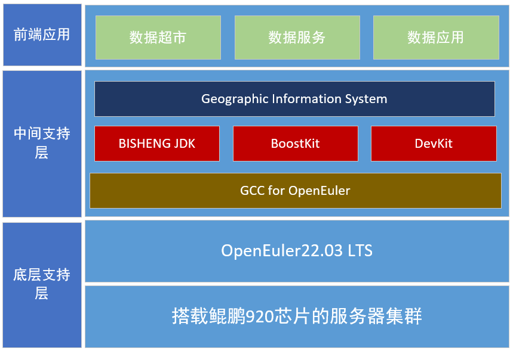

## 应用场景

时空数据平台的建设实现多为数据集中统一管理，为组织数据资源提供统一的底数、底板，促进各类数据互联互通共享。基于不同的业务场景，构建出用来支撑不同业务的数据服务，主要围绕数据服务，采集汇聚各类时空与非时空类数据，形成基础库、实体库和指标库，实现组织内数据标准的统一，并打破数据壁垒，构建统一数据实体，对外提供统一的数据服务，同时为前台业务提供了自动化、自助化的敏捷数据能力输出，提升决策水平和业务表现，以数据来驱动决策和运营，不断深化数字化转型。

## 业务挑战
时空数据平台是基于GIS（地理信息系统）二次开发的应用平台，应用系统的搭建需要坐标投影组件、jpeg组件、png组件和空间计算等组件的支持，基于openEuler对应用进行改造可获得大部分原生组件的支持。

## 解决方案

## 客户价值

时空数据平台兼容多维度的数据管理，是帮助行政机关和企事业单位管理天-空-地中蕴含的地理资源和基础设施的重要手段。

