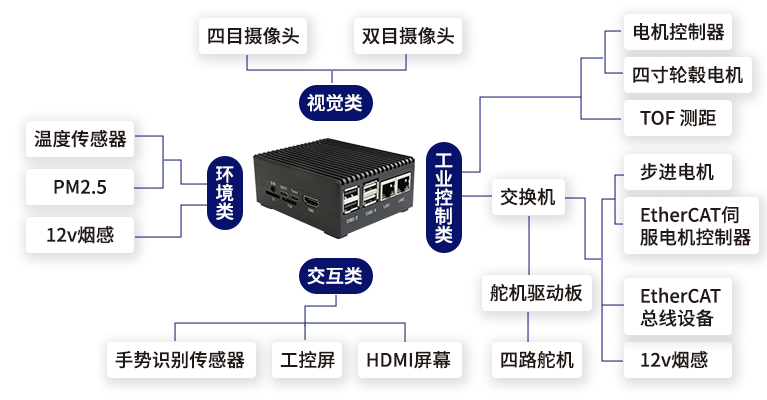

## 应用场景

工业控制：在工业自动化领域，openEuler可以用于运行实时控制系统、数据采集和监控应用程序，以实现对工业设备和流程的精确控制和监测。

物联网设备：openEuler可以为物联网设备提供操作系统支持，例如智能家居设备、智能穿戴设备、智能传感器等。它可以处理传感器数据、执行设备控制任务，并与云端进行通信。

智能交通：在交通领域，openEuler操作系统可以用于运行交通信号控制系统、车辆监控和追踪应用程序，以提高交通效率和安全性。

智能能源：在能源领域，openEule操作系统可以用于智能电网、能源管理系统和可再生能源设备。它可以监测和控制能源消耗，优化能源分配。

## 业务挑战

技术学习曲线：openEuler 是一个复杂的操作系统，涉及到许多技术领域和概念。学习和理解相关的技术知识可能需要一定的时间和努力。解决方法包括参加培训课程、阅读官方文档、参与社区讨论以及向有经验的用户请教。
兼容性问题：由openEuler是一个开源操作系统，可能会存在与某些硬件设备或应用程序的兼容性问题。在部署openEuler之前，需要进行充分的兼容性测试，确保系统和应用能够正常运行。可以与硬件供应商和应用程序开发者合作，获取支持和解决方案。

## 解决方案

该机器人解决方案基于易百纳技术社区研发的欧拉派系列之海鸥派硬件平台，结合高安全性、可扩展性、高性能等特性的OpenEuler操作系统（版本：23.09），通过集成各种传感器、执行器和控制模块，实现机器人的智能化、自主化和协同化。该方案提供了一系列工具和服务，使用户能够轻松地开发和部署机器人应用，并确保机器人系统的安全、稳定和高效运行。

## 客户价值

易百纳致力于实现在机器视觉等相关⾏业内让开发工作更快、更⾼效、 更通⽤，提速企业伙伴应⽤开发，加速项⽬落地实施。本次海鸥派搭载安全、稳定、易⽤的openEuler操作系统，给到客户多一种认识与选择，加速全国产进程进一步实现。
