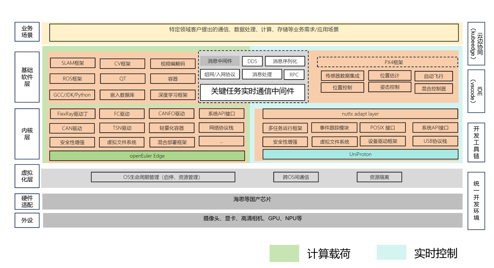

## 应用场景

随着智能化等前沿科技快速发展，无人装备在军事、应急、交通等领域的应用越来越广泛，应用场景也越来越复杂，包括无人设备之间的协同作业、交通管理、急救响应等多种情况，对操作系统提出了更高的要求，无人装备统一操作系统，采用新型边端协同计算架构，能够实现无人机和无人车、机器狗等无人装备的存储、计算等能力和资源在系统中的合理分配，不同的无人装备子系统之间通过关键任务分布式通信中间件高效协同，为复杂的无人装备协调操作场景铺平道路。

## 业务挑战

实现有人/无人装备协调、无人装备协同以及云边协同的业务挑战主要集中在几个关键领域：

首先，协同效能问题，需要考虑无人装备和有人装备间接口的兼容性和通信的有效性，适应并优化驱动设备的性能。

其次，是实时性问题，确保无人装备之间、有人与无人装备之间的数据传输和响应能够满足实时需求。

第三，是云边协同中的安全与隐私保护，需要实现在传输和存储过程中数据的安全，包括有效的加密和访问控制等措施。

第四，是处理技术更新与设备升级的挑战，需要考虑如何高效、安全地进行OTA升级，并实现平滑的过渡。最后，是对于无人装备协同中资源的合理管理和调度，以达成任务需求和提升系统操作效率。

## 解决方案

基于openEuler主要技术创新，包含：

  1、基于Jailhouse实现openEuler与UniProton双系统混合部署，openEuler域主要处理与云端的通信以及边缘计算任务，如无人装备间协同、有人无人装备协同、数据分析与处理、设备状态监控与报告、远程设备管理以及提供OTA服务。UniProton系统主要负责无人装备的实时性任务，包括设备间的协同控制。双系统紧密协同，保障系统高效与安全运行，在满足多样化需求的同时，未来有望通过这种混合部署的方式更好地推动有人/无人装备协同和云端/边缘协同的发展。

  2、基于openEuler构建关键任务分布式通信中间件优化有人无人及无人装备间的协同通信。以其实时性和高效性满足了设备间互动的实时需求，以及响应的高速性需要。通过采用发布-订阅模型，不仅减轻了通信的复杂度，也提升了数据传输效率，同时它的支持多种通信模式，为不同需求的设备协同工作提供了全面的解决方案。在设备数量增加或者网络环境发生变化的情况下，都能确保系统的稳定运行和数据的完整性，提高了有人无人、无人装备协同的运算效率和安全性。

## 客户价值

基于openEuler的统型的无人装备操作系统平台， 能有效地连接有人、无人装备，能够满足包括全面感知无人环境、实时可靠的数据和命令传输、无人设备间的协同互动、智能化数据处理及保证数据隐私的行业需求。

