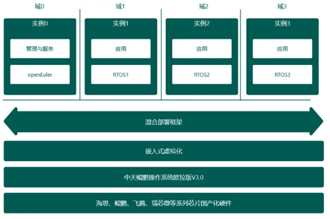
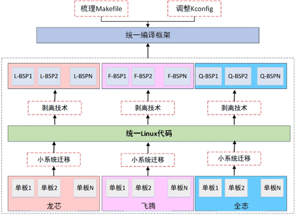

## 应用场景

随着通信、网络、航天技术的不断发展，卫星的功能越来越强，对有效载荷控制的星载计算机提出了更高的要求。星载计算机软硬件系统日趋复杂，传统的星载计算机软硬件设计方法，已逐渐不适应这种要求。基于宇航级智能化实时操作系统的基础底座构建，有效解决上述问题，支持航天国产化芯片，人工智能框架构建，协议中间件兼容、以及星务软件部署等技术，并在卫星上实现产业化，推动航天产业的高速发展。

## 业务挑战

随着卫星性能的提升，卫星载荷嵌入式操作系统针对实时性、安全性、可靠性以及易用性都需要针对性的研发，航天数智基座的建设迫在眉睫。

## 解决方案

基于openEuler主要技术创新，包含：

 在实时性方面，卫星载荷要求的中断延迟与任务调度延迟越来越苛刻，需要嵌入式操作系统提升内核的硬实时响应能力。如：任务切换时间小于10us，中断响应小于10us。

 在安全性方面，已形成星载载荷安全技术的操作系统研究方法，提供全方位的安全控制策略。通过内核空间内存和用户空间内存资源隔离，防止内核数据被非法传递到用户空间内存。操作系统同时支持异常信息采集并回传地面实时安全态势感知

 在高可靠方面，内核分区设计实现单粒子防护，提供自动恢复错误分区的功能。充分考虑系统尺寸的精简性和系统资源利用的有效性，基于内核中断和异常机制，设计星载黑匣子功能，实现星载实时监控。

 在高易用性方面，菁蓉联创欧拉版基础软件平台包括嵌入式操作系统内核、板级支持包、基础库函数、遥测遥控等，并实现对应用软件进行安装、运行、卸载、状态监控等在轨功能。

## 客户价值

- 统型的卫星载荷嵌入式操作系统平台

- 满足“通导遥”等不同类型商业卫星的基础库支持

- 支持多种卫星载荷特色功能

- 方便快速产业化，加速卫星制造
