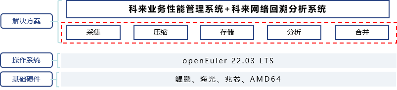

## 用户背景

科来网络技术股份有限公司成立于2003年，专注于网络流量分析技术的研究，研发的产品广泛应用于智能运维、云网运维、安全分析、工控安全等关键领域。2018-2019 年，科来网络蝉联Gartner魔力象限NPMD“远见者”称号，2020-2021年Gartner NPMD市场指南唯一被详细介绍的中国企业，IDC报告显示2018-2022年连续五年位居NPM领域榜首，2022年荣获红鲱鱼Global Top100企业称号。

## 业务挑战

随着网络技术的飞速发展与业务对网络资源需求的空前增长，企业网络规模越来越复杂，网络流量组成的多样化，网络故障也随之经常出现。支撑核心业务的网络运维工作，包括网络基础设施、相关的应用系统、数据库以及安全保障系统的运维已经成为至关重要的工作。对大多数企业而言，每月总会出现几次与网络有关的业务中断或减速。这些中断可能会影响到公司的业务能力，而企业往往很难诊断出业务中断或减速的原因。如果没有合适的工具，网络问题很难定位到根源。

## 解决方案

科来业务性能管理解决方案，由前端数据采集探针（科来网络回溯分析系统，英文简称“RAS”）与后端统一性能管理分析平台（科来业务性能管理系统，英文简称“UPM”）组成，该解决方案提供了整合端到端的交互数据可视化及分析能力，实现了从故障发现到定位根源，再到追溯取证的网络故障处理流程。
RAS可分布式部署在用户网络的各个重要汇聚节点，通过交换机端口镜像或流量分流设备等方式实时采集、存储与分析全部的网络通信数据，实时采集分析网络及业务的关键性能指标；后端的UPM分析平台对RAS进行集中管理和配置，并对RAS采集的数据进行集中分析和展现。该解决方案提供了整合端到端的交互数据可视化及分析能力，实现了从故障发现到定位根源，再到追溯取证的网络故障处理流程。

方案基于鲲鹏、海光等国内主流硬件与openEuler 22.03LTS为智能底座，完成对现有平台的全栈移植、调优，极大提升了用户业务网络的运维效率和故障处理能力，让用户在更安全的环境下，实现更高效、更稳定的智能运维。

## 方案架构图

## 优客户价值

- openEuler充分释放计算芯片的潜能，支撑用户业务系统运行更高效，更稳定，提升复杂业务系统运维的能力和效率。

- 基于openEuler系统的高处理性能，实现秒级分析精度，及时反馈出对业务的影响，并定位问题所在，从而帮助运维人员迅速排除故障，缩短了排障时间。

- 基于业务的统一性能管理，能够对支撑整个业务的网络及应用性能进行自动化实时监控和分析，实现自动化与智能化的业务网络性能管理，有效的降低人力投入成本。

## 伙伴

