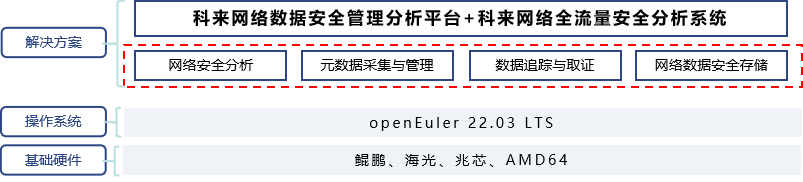

## 应用场景

传统安全防御设备主要是针对已知攻击进行的；面对未知攻击，传统安全防御设备的识别能力成为防御的瓶颈。科来网络的安全理念“只要是网络攻击就必定会产生网络通讯数据。网络攻击行为和正常网络行为是不一样的”。科来安全分析解决方案为用户提供“检测”和“响应”的能力，通过安全分析最终帮助用户提升安全防御水平。

## 业务挑战

无论是操作系统、应用软件、网络设备还是业务系统都普遍存在未知的漏洞，这使得在网络军火民用化、网络攻击组织化的大背景下，网络安全面临更加严峻的挑战。传统的安全监测方法大都是基于已知规则库进行监测，可检测出已知安全威胁，但对未知威胁则无能为力，且对正在发生或已造成损失的入侵行为无法做到完整的溯源取证和损失评估。

## 解决方案

科来全流量安全分析解决方案是基于网络全流量分析技术，旁路采集、分析和存储所有网络流量，通过威胁情报系统检测已知威胁，通过回溯分析数据包特征、异常网络行为，发现潜伏已久的高级未知攻击。科来网络全流量安全分析系统具备多维的数据分析及深度挖掘能力，能够实现数据包级的追踪取证。网络全流量分析技术是发现APT网络攻击的重要技术手段，帮助用户建立自适应网络安全架构。该解决方案提供了面向资产的全流量安全闭环分析能力、面向海量全流量数据一站式溯源调查取证能力、海量全流量数据统一安全建模分析能力。

方案基于鲲鹏、海光等国内主流硬件与openEuler 22.03LTS为智能底座，完成对现有平台的全栈移植与调优，助力关基用户提升安全防御水平及全面感知网络威胁能力。

## 方案架构图

## 客户价值

- openEuler充分释放计算芯片的潜能，软硬一体，单台设备即可满足40Gbps+流量解析、检测、存储、回溯需求

- 基于openEuler系统的高处理性能，以及科来强大的网络协议解析能力，能够实现全网流量与资产可视，网络可知、流转可见、安全可感知

- 支持L2-L7层流量全维度检测，灵活的流间行为关联分析技术，定制化安全检测能力

- 支持和第三方态势平台/SOC平台集成与数据对接，助力安全运营智能化、自动化

## 伙伴

