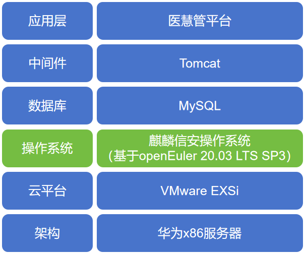

## 应用场景

湖南省康复医院是省卫生健康委直属公立三级康复医院，也是全省唯一一所集预防、医疗、康复、科研、教学、健康管理为一体的省级三级公立康复医院。
湖南省康复医院使用的医慧管平台由湖南蓝途方鼎科技有限公司开发，利用互联网技术，构建了包含权利事项规范运行、医疗服务管理、医疗质量安全管控、医疗设备物资管理、绩效考核、成本核算、内部审计、风险防控等功能的现代化管理与风险防控系统。平台使用信息化工具保障制度的高效科学执行;实现医院管理水平的科学化、规范化与精细化。

为了响应国家科技自主创新战略，加强信息安全建设，湖南省康复医院针对医慧管平台进行底层操作系统改造，将原来部署在X86架构服务器上的CentOS操作系统全部替换成基于openEuler社区的麒麟信安服务器操作系统。

## 业务挑战

1、兼容性

在本项目之前，麒麟信安服务器操作系统没有与蓝途方鼎的医慧管做过兼容适配工作，将客户运行多年的CentOS系统迁移替换为麒麟信安操作系统，对医慧管平台的稳定运行是个较大的挑战，存在较多的不确定因素，需要提前做好兼容适配工作和相关应急预案。

2、可靠性

客户的医慧管平台承载着医院内部多个重要服务管理功能，为医院的正常业务开展提供技术支撑，比如会议室管理、供应商管理、资产管理、预警监控、经营分析等都是医院使用频率高的服务功能，业务支撑平台的故障将影响医院业务的正常开展，因此对服务器操作系统的可靠性要求高。

3、安全性

医慧管平台管理着全医院的资产数据、经营数据、患者数据等，数据量较大，且都是医院内部很重要的数据，涉及医院的机密信息和患者的隐私信息，网络攻击导致的信息泄露可能引起很多无法预知的负面影响，因此康复医院对数据信息的安全性要求极高，对底层的服务器操作系统也是较大的挑战。

## 解决方案

湖南省康复医院的医慧管平台架构最底层物理服务器为华为X86架构服务器，第二层为VMware云平台，VMware云平台完成对底层服务器硬件资源的计算、存储和网络的虚拟化，通过服务器虚拟化实现了资源的弹性伸缩和灵活调度，在云平台的虚拟服务器上安装服务器操作系统，客户原来安装的是CentOS7.9开源免费版操作系统，本次应客户的需求我们将其迁移替换成基于openEuler社区的麒麟信安操作系统，客户的业务系统还采用了MySQL数据库实现对数据的存储处理等，中间件Tomcat为上层的应用软件提供运行与开发的环境。

为了确保底层操作系统的平滑迁移替换后，客户的业务系统能正常运行，前期联合湖南蓝途方鼎公司对麒麟信安操作系统（openEuler商业发行版）和医慧管平台进行软件上的兼容适配工作，经过多轮严格的适配验证测试，取得了双方都认可的兼容性互认证证书，同时也在湖南欧拉生态创新中心完成了对数据库MySQL和中间件Tomcat的兼容适配工作。

为了操作系统的迁移实施顺利进行，麒麟信安自研的C2K2.1迁移工具提供了一站式迁移服务，减少了实施人员的误操作，提前收集客户的业务系统运行环境，制定迁移实施方案，实施方案验证、应急预案准备等，公司强大的二线技术支持专家和研发团队保障了系统迁移的顺利实施。

## 客户价值

基于openEuler社区自研的麒麟信安操作系统在湖南省康复医院的成功应用，为湖南康复医院建设成医院现代化管理与风险防控智慧云提供了坚实的底层系统支撑，结合蓝途方鼎公司的医慧管平台，利用大数据、安全云等信息技术，实现了管理业务一体化，构筑管理工作新形态。

将用户业务系统底层操作系统成功从CentOS替换为国产操作系统，安全性得到保障，解决了客户可能面临的系统安全漏洞风险、系统瘫痪等痛点问题，同时麒麟信安操作系统提供的三权分立、黑白名单安全机制、细粒度的安全审计等四级安全防护功能提升了客户数据的安全性，推动了医疗行业信息系统向自主创新的演进。