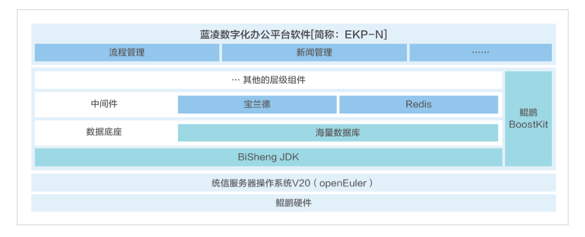

**应用背景**

蓝凌软件的数字化办公产品EKP-N旨在通过定制多场景办公解决方案，提升企业运营效率。在数字化转型的浪潮中，蓝凌软件寻求一个能够全面适配并高效稳定运行的操作系统，以实现流程效率的显著提升。因此，蓝凌软件选择了openEuler操作系统，以期通过其优化特性，提高系统性能和安全性。

**解决方案**

1.  **全面适配openEuler**：EKP-N全面适配openEuler操作系统，以及其他基础软硬件环境，如鲲鹏硬件、海量数据库、宝兰德中间件、金格流版软件等，确保系统高效稳定运行。

2.  **安全保障平台**：基于三员管理机制构建的安全保障平台，全面保障数据安全，确保系统顺畅使用且性能良好。

3.  **性能调优**：

    -   **硬件层面**：基于BIOS设置，对硬件性能进行更高程度的提取。

    -   **操作系统层面**：关闭irqbalance，进行网络参数、缓存参数调优。

    -   **软件层面**：对数据库参数、web中间件进行调优。

4.  **性能提升效果**：EKP-N产品在原解决方案的基础上，整体的TPS较低，经过调优后，部分性能实现了翻倍，整体达到了30%-50%以上的提升。

> 

**客户价值**

1.  **办公效率提升**：构建完整的鲲鹏软硬件体系，流程数据秒吞吐量提升2倍，平均响应时间降低至1/6，办公平台功能无缝集成，流程效率提高85%。

2.  **信息安全保障**：蓝凌将政府、金融、新基建等行业最佳实践融入基于openEuler体系的数字化办公，并辅以成熟的实施方法论，通过专业团队，保障不同行业项目快速落地、应用。提供从网络、设备、数据到登录、应用、权限等全程安全保障。

3.  **性能优化效果明显**：经过调优，EKP-N产品的性能得到了显著提升，部分性能翻倍，整体性能提升30%-50%以上。

4.  **客户案例实证**：国信证券、中信证券、招商证券、易方达、南方基金、博时基金等知名企业选择蓝凌EKP-N作为其数字化办公平台，实证了该应用在实际业务中的应用效果和价值。
