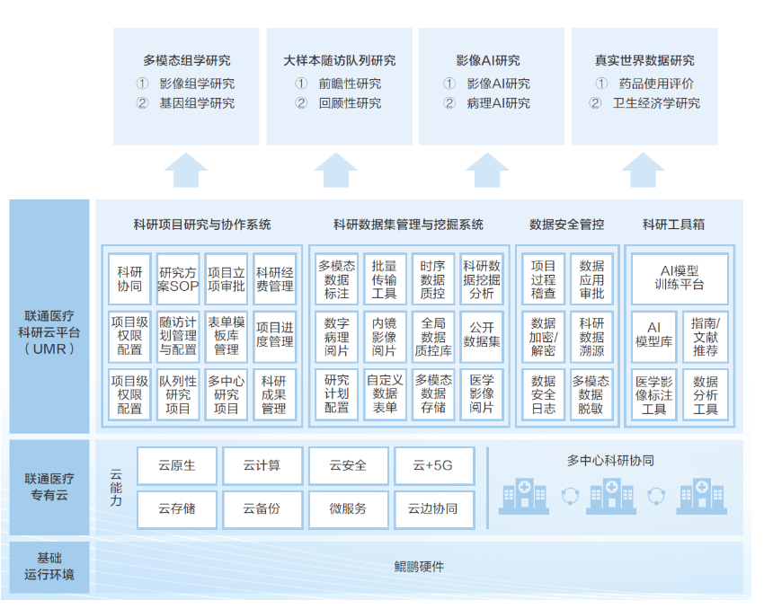

## 用户背景

联通医疗科研云平台，以“服务医改、惠及民生”为宗旨，致力于提升科研协作效率，打通多中心研究壁垒，实现医学研究的数字化升级，构建以医疗云、医疗大数据、大健康应用为基础支撑的健康医疗生态，提供从顶层设计、综合解决方案到信息系统测评的全场景智慧医疗服务。

## 方案介绍

联通医疗科研云平台基于openEuler开源操作系统运行，进行全栈优化，快速分析迁移兼容性、编码辅助、Hive SQL1-5场景性能平均提升7% 。 使用鲲鹏开发套件DevKit和鲲鹏应用使能套件BoostKit中的KAE加速引擎，国密加解密SM3、SM4、并发查询吞吐量性能均大幅提升。

## 方案架构图

基于 “X86+ARM+OpenPower”三架构混合部署，核心基础硬件适配鲲鹏、海光等主流芯片，操作系统选用银河麒麟操作系统，向上支撑数据库、中间件与应用软件，构建云平台架构。

## 优势亮点

-   科研协作效率提升：依托于鲲鹏硬件，在多个场景下吞吐量大幅提升，助力科研协作流程，提高了科研全流程协作效率。

-   多手段保障安全：依托医疗科研专有云支撑多中心研究，融入鲲鹏体系，提供多种安全保障手段，从平台到应用打造科研研究数据协同安全体系。

## 客户案例

浙江大学附属邵逸夫医院

## 伙伴

