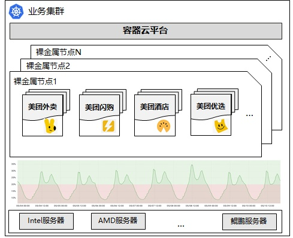
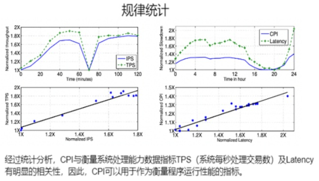
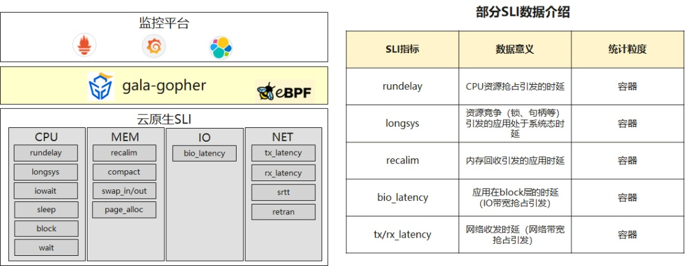
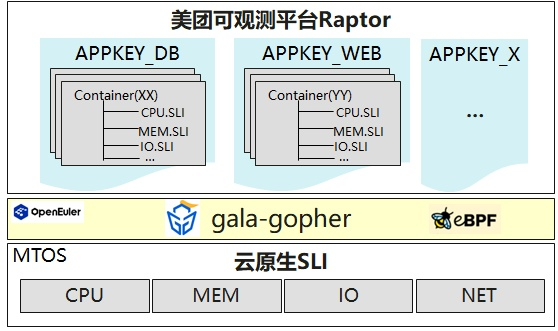
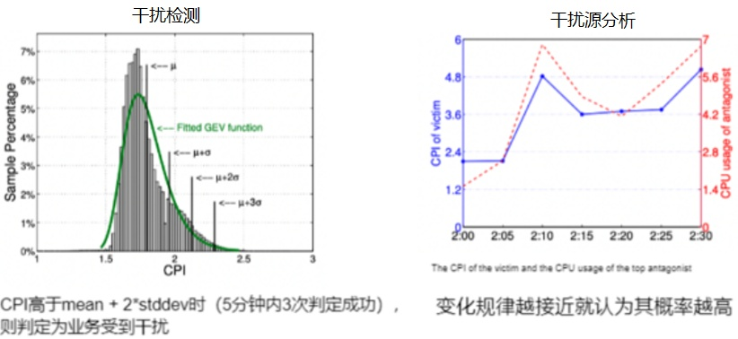
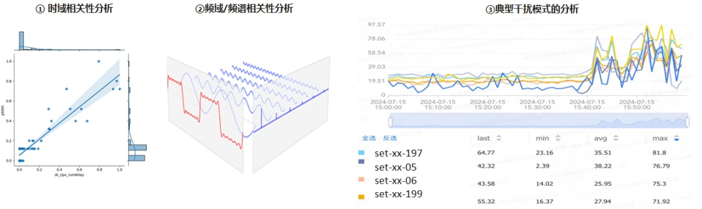
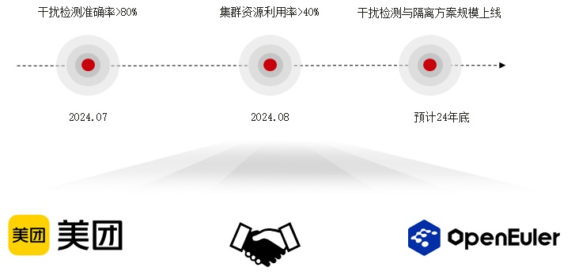
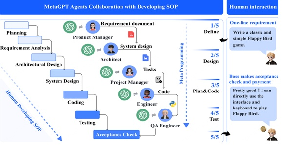
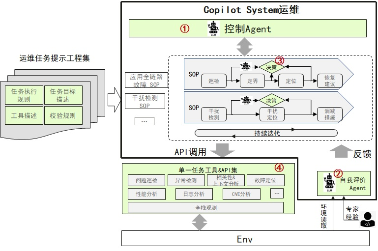

**场景介绍**

互联网场景中，鲲鹏、AMD等高密芯片提供强大的计算能力和高效的能源利用率而备受客户青睐，然而，对于互联网客户来说，在享受高密机型带来的便利的同时，也面临着如何有效管理和优化资源利用率的问题。原因是互联网核心业务普遍由容器平台承载，为了平衡性能与成本，采取裸机容器方式部署业务，由此带来了资源竞争的性能干扰，导致无法进一步提升部署密度。以美团客户为例，美团容器云平台承载美团大部分**在线核心业务**，集群规模大、服务器硬件多（包括鲲鹏/AMD/Intel），业务众多、应用特征多样化，资源超卖时引发的资源竞争成为当前高频问题，导致集群资源平均利用率维持在20%左右。在此背景下，"**在线混部场景下，裸机容器资源竞争干扰检测&恢复**"成为了业界关注的技术问题，该问题进一步分解成三个子问题：

-   干扰检测方法的通用性

-   干扰源发现的准确性

-   资源隔离与QoS控制的平衡

下面分别说明下这三个子问题的挑战与措施。

**挑战与措施**

挑战1 - 如何应对多种业务场景的干扰检测

业界存在多种技术方案，google最早在2013年提出
CPI（cycles-per-instruction）方案\[1\]用于解决这类问题，其基本思路是互联网在线作业通常为常驻作业，这类作业在同一CPU型号的CPI数据走向通常呈现一定规律，
是可预测的。所以用传统的滑动窗口预测方法，对下一周期的CPI进行预测。将实际CPI与预测CPI进行标准差stddev计算，超出阈值部分认为业务QoS发生劣化。该方案优点是技术成熟可靠，缺点是使用场景受限（仅适用与CPU密集型应用），无法应对多种业务场景。

通过多种技术对标以及各客户场景洞察，OpenAtom
openEuler（简称\"openEuler\"）采取云原生SLI（Service Level
Indicators）技术方案，通过openEuler社区项目gala-gopher\[2\]提供CPU、MEM、IO、NET四个维度的资源竞争指标，作为标识容器实例受资源竞争干扰的程度。

基于云原生SLI去检测容器实例干扰事件，依然面临使用何种特征量检测具备更高准确性的问题，因为客户存在多种业务类型，不同的业务类型对底层资源的竞争程度不同。

在美团场景中，业务类型以appkey形式管理，相同appkey的业务类型、负载高度相似，理论上相同appkey标签的业务容器应该可以采取相同特征量、检测模型。为此通过与客户联创，将gala-gopher上报的云原生SLI数据以appkey形式管理，检测特征量、检测模型以appkey维度进行部署，兼顾了通用性与准确性。

挑战2 - 如何快速准确定位干扰源

同样以google
CPI方案为例，其采取时域相关性分析方法找到干扰源。其原理是分析容器间CPI变化规律（可以理解成容器之间相同资源性能指标的变化规律），规律越相近的容器，作为干扰源的概率就越高。

但是这类方法存在一些局限性，比如：相关性阈值难以确定，不同业务类型的干扰模式不同，相关性规律也不同；难以区分干扰源与被干扰者。

在与美团联创过程中，与客户联合讨论技术方案，总结出方法论：AI算法发现疑似干扰源，结合专家经验过滤出真正的干扰源。再进一步分析，专家经验也分为两类：

规则：即可以抽象成AI算法内的规则、模型、参数调优，具备一定通用性。比如：存在多个疑似干扰源容器实例时，CPU核最多的实例，最可能是干扰源；CPU最忙的容器实例，最可能是干扰源；业务QoS波动较大的容器实例，最可能是干扰源。

知识：即与业务场景强相关的一些背景知识，通用性比较差。比如：某些容器实例由于其自身业务特点，容易造成对其他容器的干扰，因此这些容器被纳入黑名单。

openEuler
gala-anteater\[3\]项目在干扰源检测过程中，将规则提炼成AI算法的一部分，可以有效发现一些典型的干扰模式。比如在干扰源分析时，通过频域+频谱相关性分析（负载波动、峰谷周期）识别干扰源，可以有效识别业务QoS波动较大的干扰源。

典型案例：图中蓝色业务容器set-xx-05为客户外卖下单业务，该业务有两个典型特征：(1）业务负载（吞吐量）波动范围大；(2）业务高峰期吞吐量大幅波动并干扰到其他业务容器

分析过程：通过时域相关性分析可以识别出包括set-xx-05在内的其他容器实例（比如set-xx-197等），再通过频域相关分析，识别出set-xx-05容器实例为干扰源。

挑战3 - 资源超分情况下，多种资源无序竞争，如何避免业务QoS受影响

在混部业务运行过程中，由于作业间竞争共享资源(如CPU、缓存、内存带宽、网络带宽等)，往往会导致业务性能下降，性能干扰会严重影响关键业务的实时性和稳定性，亟需混部集群管理系统必须有效控制性能干扰,并根据性能干扰快速、及时地做出调整。为此，
openEuler rubik\[4\]为了适配云原生混部场景，规划了
CPU、cache、blkio、Disk I/O、Network I/O
等资源的分级抢占能力，通过软件或软硬件协同技术控制作业对资源使用的方式来降低甚至消除对资源的无序竞争。在识别混部集群中非关键业务为干扰源后，自动对业务进行降级，使得当关键业务流量上升时，内核层面能为其快速抢占到所需资源，保障关键业务的服务质量，当关键业务的流量下降时，放宽对非关键业务资源的限制，提高其吞吐率。

**阶段性成果**通过24年的社区联创工作，openEuler携手美团\[5\]在该课题方向取得了阶段性成果，干扰检测准确率达成80%（持续优化中），干扰问题能在10
分钟内止损，业务稳定性显著提升，目前正在将部分成熟技术落地到美团生产环境中。

**不足与策略**

不足

正如前文所述，干扰检测、干扰源分析与消减恢复，整个过程需要通过AI+专家共同完成。**专家知识，仍然停留在维护手册、排查清单、典型案例等文档中。**所以现在各个步骤之间仍然需要运维专家介入，整个过程的自动化、智能化能力不够。

策略

我们注意到业界可以将大模型将领域知识充分利用起来，通过结合传统的工具手段，可以智能化的高效解决一些复杂问题，举个例子，比如MetaGPT\[6\]通过SOP机制+反馈机制，将大模型能力与领域性工具有效结合，提升复杂问题自动化能力。

**openEuler Copilot
System系统借鉴该思路，将本课题过程中几个关键步骤，通过SOP标准来定义执行过程，结合反馈机制将干扰检测、干扰源分析、消减措施以及效果评估等环节串联起来。**

原型效果

基于该策略，我们已经完成原型机构建以及效果验证，下面以动态图形式展示其工作过程，整个过程完全以自然语言交互，并结合图表、文字表述，引导客户执行整个干扰检测&恢复过程，并通过维护历史案例库，持续构建客户资产。

原型架构

openEuler Copilot运维系统的架构规划

关键组件介绍

**控制Agent**：通过任务执行、校验、目标等提示信息，将持续优化目标任务自动分解成单一任务工作流，统筹控制任务流

**自我评价Agent**：针对任务结果设计反馈模板，根据环境信息+专家经验反馈，作为评价校正输出，用于决策任务流路径

**路径决策机制**：基于自我评价反馈，实现任务流路径自动化决策，提升任务成功率

**单一任务工具&API集**：完成单一任务工作以及将结果结构化输出，包括巡检，定界/定位，干扰检测、恢复建议、消减措施等

**规划与愿景**

未来，美团计划进一步引入智能化技术，提升干扰识别的精确性，并推动 API
化、工具化进程，以便更好地集成 openEuler
社区的能力，持续优化容器云平台的运行效率。

与此同时，openEuler Copilot
System运维会持续构建基础能力，拓展业务场景。通过AI
Agent+SOP机制将各类业务场景的故障诊断过程以自然语言形式自动化的驱动起来，彻底提升故障诊断过程的用户交互体验。同时，继续强化任务执行过程中的自我评价、自我决策能力，将复杂任务完全自治化。

参考：

\[1\] CPI: CPI2: CPU performance isolation for shared compute clusters

\[2\] gala-gopher：https://gitee.com/openeuler/gala-gopher

\[3\] gala-anteater：https://gitee.com/openeuler/gala-anteater

\[4\] rubik：https://gitee.com/openeuler/rubik

\[5\]
HC大会：https://www.openeuler.org/zh/news/20240930-hc/20240930-hc.html

\[6\] MetaGPT: Meta Programming for A Multi-Agent Collaborative
Framework
