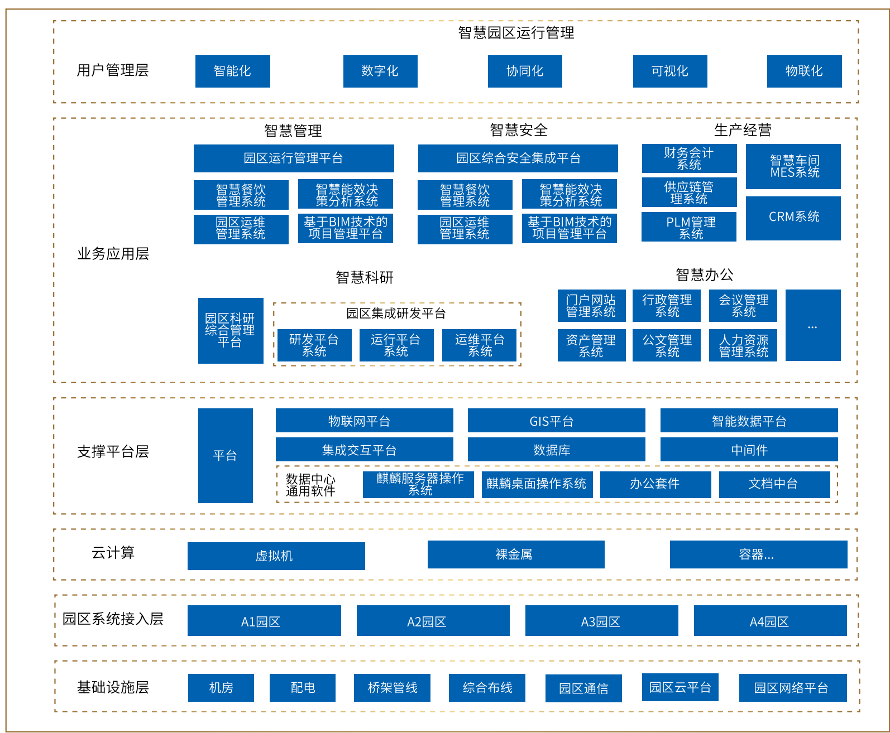

## 应用场景

民航科技创新示范区解决方案整体架构通过统一数字化平台，将示范区现在及未来发展需要用到的通用能力资源池化，支撑未来升级和扩展，避免重复建设和浪费。同时通过统一数字化平台打破信息孤岛，实现业务与数据联动，打造智慧化建设的接入标准、数据标准、数据交换标准，实现统一运维和运营。

## 解决方案

- 该项目通过统一数字平台，打破信息孤岛，实现业务与数据联动，打造智慧化建设的接入标准、数据标准、数据交换标准，实现统一运维和运营。

- 民航二所云桌面底层建设全部采用银河麒麟高级服务器操作系统V10，瘦终端采用银河麒麟桌面操作系统V10，云桌面内全部采用银河麒麟桌面操作系统v10，云平台整体采用海光架构进行建设，满足用户的日常办公、科研等。

- 民航二所服务器整端整体采用华为云，云内统采用银河麒麟高级服务器操作系统V10，向下支持C86和ARMCPU架构服务器，向上兼容国内外的数据库、中间件、业务系统等。

## 客户价值

通过本次项目的整体建设，整个项目的核心自主创新成果如下：

- 中国民航科技创新示范区在基础资源领域，通过整合海光、鲲鹏和飞腾等三种架构体系，成功打造了一套高度丰富和多样化的信息化基础架构，这构成了一个全面的网信栈。这一举措为民航科技创新提供了更广泛的技术支持和灵活性，有助于满足不断增长的需求，并推动民航行业在数字化领域取得更大的成就；

- 在业务应用方面，为满足新园区的日常需求，此次建设包括五大板块，涵盖了智慧管理、智慧安全、生产经营、智慧科研和智慧办公。这些板块旨在优化和丰富园区的业务内容，为各领域提供更全面、智能化的解决方案，以满足不断变化的需求和促进协同工作；

- 桌面云方面，完成基于 ARM + x86 架构 + 银河麒麟桌面操作系统 V10 的适配建设，支撑日常办公、产品研发、产品测试等需求。

## 合作伙伴

