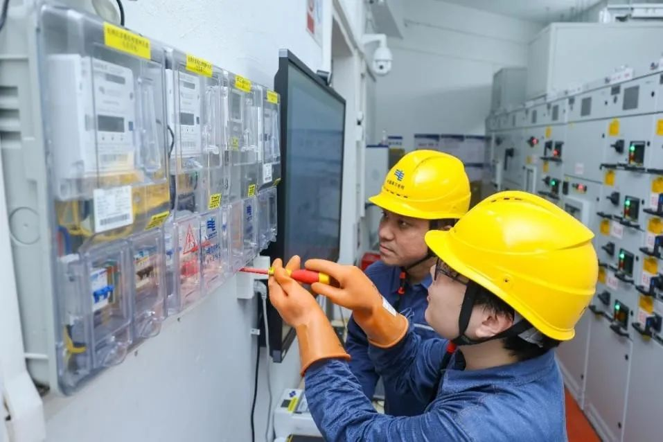

**应用背景**

随着物联网技术的发展，电力行业中出现了大量的智能设备，这些设备来自不同的厂商，使用的操作系统和通讯协议也不尽相同，导致设备之间的互联互通存在障碍，海量终端的运维成本高，统一升级困难导致安全风险高。为此南方电网数字电网研究院有限公司与粤港澳大湾区国创中心工业软件产业发展中心（国创工软）中心合作，基于OpenAtom
openEuler（简称\"openEuler\"）打造"电鸿"统一电力操作系统基座。

**业务挑战**

-   需要统一的电力设施基础底座打通全场景

需达成openEuler嵌入式操作系统在电力行业领域的应用，场景包括发、输、配、变、用等各个环节的边端设备中使用，例如智能电表、智能网关、台区终端、巡检终端、调度设备等。

-   各设备协议七国八制，数据难以采集运维

物联网技术推动电力系统智能化发展，各环节部署众多终端与元件，其数量随新型电力系统激增，引发运维、安全、资产管理挑战。设备复杂、协议多样，使得终端维护难度加大，安全风险上升。

**解决方案**

-   基于openEuler 22.03 LTS与openEuler 24.03 LTS版本；

-   操作系统按需裁剪适配，实现弹性可伸缩；

-   借混合部署底座加载实时操作系统；

-   建立统一物模型与通信协议，保障设备流畅连接；

-   运用分布式软总线技术打破设备边界；

**该解决方案具有以下特点：**

**安全性**：因电力行业对安全要求极高，运用国密、商密技术及独立微内核 TEE
OS，达到高级别安全认证要求，保障安全与隐私。

**统一物联模型**：开发内置模型，简化数据相关复杂性，促进设备协作，提升系统灵活性与扩展性，使其能应对复杂工业环境，保障信息高效处理。

**混合部署技术**：结合多核 AMP
硬件，创新融合关键设备为台区终端，优化资源利用，降低成本，展现提升系统效能等多方面潜力，为相关领域提供范例。

**生态兼容性**：丰富电力领域生态，涵盖南向多类芯片，北向开发电力相关中间件、规范、服务及数据标准协议等。

**易用性**：通过功能扩展实现设备即插即用，降低成本，提升易用性，优化客户体验。

**分布式软总线技术**：整合该技术至 openEuler Embedded
系统并应用于电力物联网，实现设备高效互联互通，在多场景展现价值，助力构建电力系统智能化框架，提升运行效率与可靠性。

**部署规模**

2024年7月，在深圳前海、广州南沙、珠海横琴等地，完成了电鸿综合示范区的建设，三大建设区均已完成终端设备研发适配、电厂安装、展厅规划等工作，于9.30完成基线版本验收。

2024年8月，广东电网公司广州供电局在110千伏尖峰变电站率先完成继电保护及综自装置的电鸿适配多品类设备挂网试运行工作，这是国内首次电力核心装备的电鸿化应用，标志着"电鸿"系统与电力系统主要设备成功实现了联通融合。通过开展电鸿对多核CPU的非对称多处理工作模式以及实时性提升技术攻关，基于电鸿的混合部署技术，解决CPU一芯多核异构、控制应用分离、数据采集实时性问题，成功实现电鸿化控保设备、时间同步装置的示范应用，验证了"电鸿"对强实时控制保护类应用场景的有力支撑。

电鸿示范区党员突击队成员安装电鸿电表

**客户价值**

-   弹性伸缩与可裁剪适配。面对海量终端对操作系统的要求不一做到弹性可伸缩，操作系统在满足基本功能和安全要求情况下，可以做裁剪和适配到不同终端中。

-   满足高实时性要求。通过混合部署底座加载实时操作系统满足不同电力场景对系统实时性要求，满足数据采集和控制功能对系统的高实时性要求。

-   统一协议提供流畅体验。基于数据格式和协议不统一，建立统一物模型和通信协议，实现即插即用，降低安装调试成本，北向通过数据封装，方便数据上传，南向为多设备融合提供统一的底层能力,提供设备间高吞吐、低时延、高可靠的流畅连接体验。

-   实现设备数据共享。通过高并发的分布式软总线技术打破设备的边界，实现设备之间数据共享和通信畅通、硬件互助数据和服务共享。

**选择openEuler Embedded的优势**

openEuler
Embedded在电力物联网领域展现出了广泛的应用规模与卓越性能。其独特的弹性伸缩系统，确保从微型终端设备到边缘工业设备，均能无缝集成并稳定运行，支持百万以上的边端设备，展现了其强大的适应性和广泛的覆盖能力。这一特性使得openEuler
Embedded成为众多行业数字化转型的理想选择。在并发处理方面，openEuler
Embedded的高并发软总线技术更是行业领先，能够同时连接超过200个物联设备，确保在高并发场景下系统的稳定运行与高效响应。这一特性对于需要处理大量实时数据的工业应用尤为重要，能够显著提升生产效率和系统稳定性。

**未来规划**

不断推进电力设备终端适配，预计2025年实现300余款子类设备适配，逐步实现输变配领域100万套物电力终端装置全覆盖，2026年到2030年实现调度、用电侧设备接入，覆盖终端规模可超千万级。
