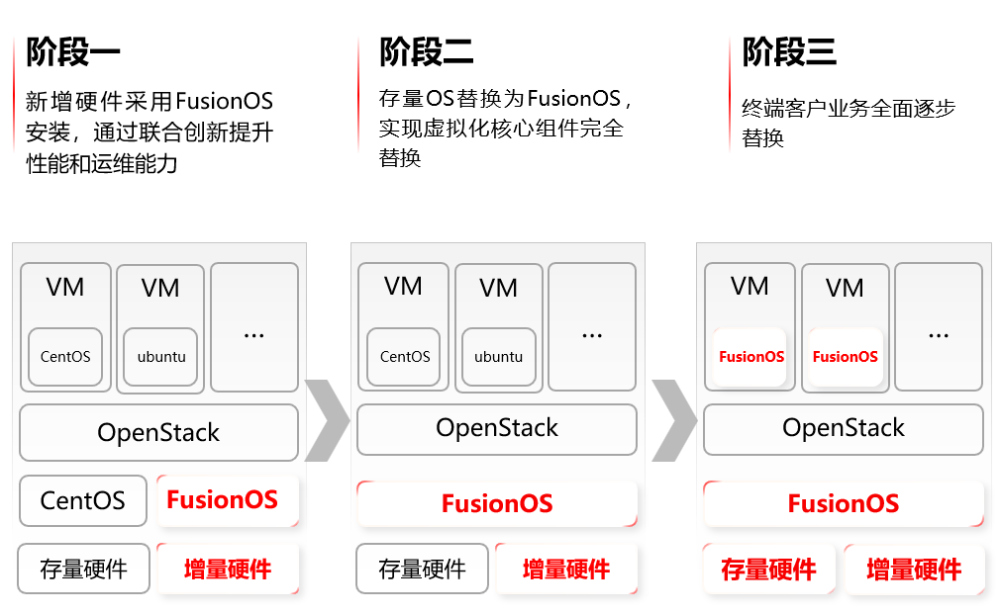

## 应用场景

创普云边缘计算云服务平台，致力于为图形云计算、AI 人工智能、HPC 高性能计算、工业互联网等 5G 新型应用场景提供超算性能、超低时延和超大数据传输的云计算基础设施能力。创普云边缘计算云服务平台现网主要使用的操作系统是 CentOS 和 Ubuntu ，随着业务规模的快速扩大，如何解决操作系统的可靠性问题和应对伴随而来的运维挑战，是一个迫在眉睫的棘手问题。

## 解决方案

图1-1FusionMES.eCurve系统架构

- 根据创普云业务诉求提供定制化服务器及支持长期自主创新的超聚变操作系统 FusionOS；

- 软硬协同深度优化，进一步提升整体方案的可靠性、运维能力及平台性能；

- 基于“安迁”一站式迁移平台提供端到端迁移服务，助力客户操作系统、业务高效迁移。

## 客户价值

- 5000+操作系统高效、安全迁移至 FusionOS，实现核心业务服务器操作系统替换。

- 使创普云能够为最终用户提供更加稳定、更易运维、性能更好的平台，提升创普云边缘计算云服务平台的核心竞争力：

- 安全可靠，运维能力对接，关键资源 100%监控

- 高效率，开箱即用，高效上线，运维效率提升 100%

- 高性能，联合创新，软硬协同调优，性能提升 15%+

## 伙伴

