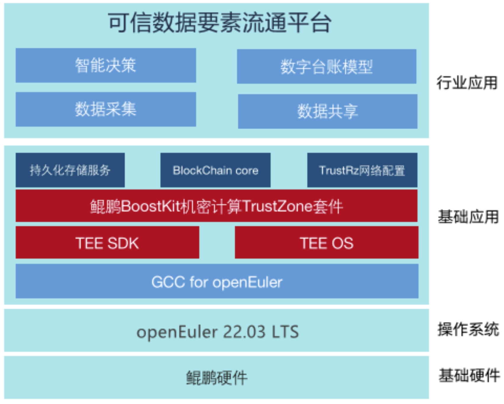

## 应用场景

江苏荣泽信息科技股份有限公司（简称：荣泽科技），依托区块链和人工智能的人才和技术储备，专注于运用人工智能、区块链等新一代信息技术为社会提供数字化治理解决方案和运营服务，其提供的基于区块链的晓数通产品，通过可信采集原始数据，建立标准台账模板，一键生成目标报表，实现从台账到企业一套表上报的全流程管理和上报，实现目标报表的“数出有据”。该平台能够帮助企业自主提升数据治理能力、强化数据质量与安全、促成高质量数据流通、实现可信数据服务交互的应用。

## 业务挑战

区块链系统作为底层基础设施对企业数字台账平台发挥着至关重要的作用，是助推企业信息化改革的重要一环。随着企业的不断发展，海量的经营数据和庞大的组织流程让统计工作越来越复杂，因此，承载数字台账平台的区块链算力基础设施也面临着更多挑战：

①数据处理规模大、周期长：
海量的统计数据，需要大量的计算分析，高峰时交易量在20000笔/秒。

②高安全性：

区块链去中心、自治化的特点使得企业数字台账平台需要构建满足信创要求的高安全、可信赖、全溯源的底层技术架构以有效预防安全漏洞。

③高可用、高扩展：

可信数据要素流通平台新型端边云融合架构要求底层操作系统能够屏蔽不同类型设备之间的架构、环境、算力、存储等方面的差异，为上层应用提供统一、稳定、可扩展的运行环境，并且满足区块链和工业互联网的扩展需求。

## 解决方案

openEuler作为面向数字基础设施的开源操作系统，其全场景适应性、高性能、高可靠性、多样化的算力支持能够很好的满足可信数据要素流通平台新型架构下对算力、安全和可扩展的要求；此外openEuler热部署、热升级和热恢复特性，可以大大提高系统的灵活性和可用性；其分布式实时加速引擎和基础服务使区块链作为底层基础设施建设具备了更强的能力、更便捷的开发效率与更简单高效的服务能力。

基于上述考虑，荣泽科技与openEuler达成了深度合作，基于鲲鹏软硬件平台及openEuler操作系统 ，共同打造可信数据要素流通平台，以可信数据确权流通为关键驱动要素，为政府、链主企业、信息化平台及各类商业生态方提供可信开放的数据底座。

方案架构图

## 客户价值

- 迁移：基于openEuler迁移工具套件，1人天/应用快速迁移可信数据要求流通平台。

- 开发：基于EulerLauncher 跨平台开发者工具高效开发机密智能合约功能，开发效率提升50%。

- 调优：通过EulerFS文件系统以及A-Tune智能调优引擎深度优化，调优后性能最高提升50%。

## 为什么选择openEuler或其发行版？

选择openEuler 22.03 LTS版本作为解决方案，主要考虑：

1、全场景适应性、高性能、高可靠性、多样化的算力支持；

2、产业生态支持及覆盖的行业广泛；

3、版本稳定、长期演进和技术支持。

## 未来规划

未来计划在晓数通终端产品使用openEuler，以支持更多的终端及芯片类型（RK3588等）。

