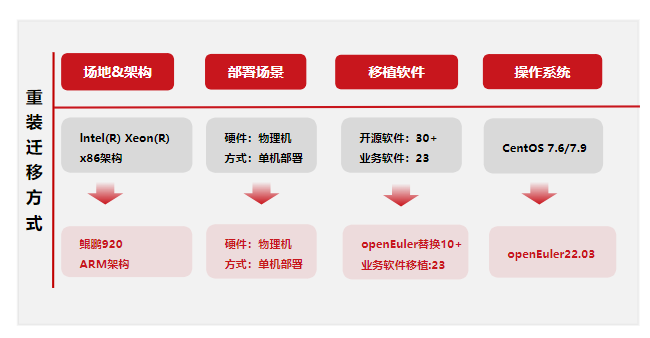

## 应用背景

软通动力基于CentOS平台自研的园区智能管理平台已在全国20多个局点商用，为了响应客户的诉求对现有操作系统迁移，本案例基于openEuler操作系统对当前的园区智能管理平台进行迁移适配。
迁移方案涉及使用的软件包总计35个，分为：中间件、数据库、依赖包等，其中主业务软件采用java和vue编写，其他组件多为开源组件。开源组件经过前期的DevKit工具评估，其中有20款软件需要重新编译适配，6款软件可以使用系统自带软件包进行替换。其余都为业务软件编译依赖，不需要适配。

## 方案架构图

- 根据客户诉求和整体调研信息，分析整理出本次的迁移方案为跨架构的操作系统替换和业务软件的适配重装，并将原有业务数据恢复至新装系统。

- 操作系统选用openEuler 22.03 LTS版本，并将原有x86架构的业务恢复到arm架构新系统上。

## 客户价值

- 解决了传统系统跨架构无法兼容、性能存在瓶颈、系统维护难度大、维护成本高的问题。

- 开源软件维护量减少30%；园区部署时长降低37%；园区人力投入减少28%；迁移后性能提升3%。

- 基于openEuler迁移的软通动力园区智能管理平台凭借在效率、性能、易用性等方面的优化，获得2022鲲鹏应用创新大赛陕西赛区银奖。

## 伙伴

