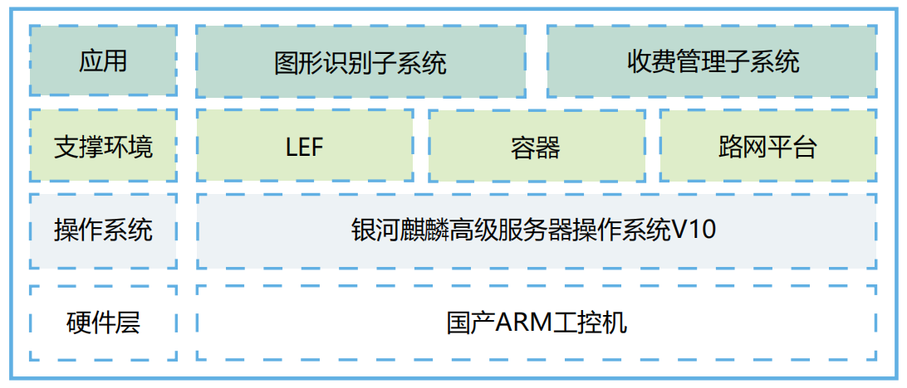

## 应用场景

高速公路 ETC 门架系统是国家深化收费制度改革，取消全国高速公路省界收费站，实现车辆分车型、分段计费的重要设施。通过 5.8GHz 专用短程通讯技术读取车载 OBU 或 CPC 卡的信息，实现车辆分段计费、车辆路径标识、流量调查、视频监控、超速筛查等功能，是对原有省界收费站物理拆除后计费的必要补充，极大地提高通行效率。

## 解决方案

基于调研发下以下难点：

- 1、前期需求论证阶段，在桌面级CPU基础上安装服务器操作系统时，用efi传统模式引导均不能够正常引导安装，通过摸索不断尝试发现用DTL串口线进入调式模式才能够顺利安装系统。此外还需要配置安装各类业务系统运行环境组件。

- 2、上线入网测试阶段，因ETC门架系统都是分布在整个四川省内高速公路各个路段上，需要实际上到高速路ETC门架现场，路途较远，有一定的出行危险性，同时还面临克服各种天气。

- 3、交付和后续运维都需要人工上到高速路门架现场，难度较大。

底层建设全部采用银河麒麟高级服务器操作系统V10，向下支持飞腾CPU架构，向上兼容国内外主流数据库、中间件、业务系统等，实现容器、时间同步、LEF平台、门架系统等多个常用技术组件及系统在飞腾 CPU+ 银河麒麟服务器操作系统、工控机架构的完美运用。

## 客户价值

- 该项目作为四川省乃至全国首个桌面级 CPU 安装服务器操作系统场景，成功上线 ETC 门架业务系统，打破Win 系统长期垄断 ETC 门架系统行业困局，实现了软硬件对现有平台改造；

- ETC 门架系统的自主创新有助于提升我国高速公路管理水平，降低运营成本，推动交通产业升级，为国家信 息安全、绿色低碳发展等方面提供有力支持，对构建现代化交通体系、推动交通强国建设具有重要意义。

## 合作伙伴

