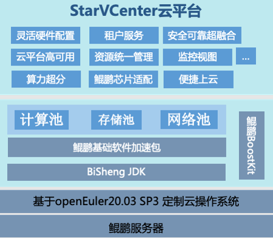

## 用户背景

四川中电启明星信息技术有限公司成立于1999年，本部设在成都，主要服务于能源企业和大中型集团。公司以云网大数据为依托，全面支撑新型电力系统建设，致力于成为国内领先的智慧能源平台型互联网企业。

## 应用场景

StarVCenter是基于openEuler定制的自主创新云平台，帮助企业自建私有云，提供云主机、云网络等基础设施服务，兼容鲲鹏、飞腾、海光、兆芯等芯片服务器，满足企业对异构算力的需求。在StarVCenter上，企业可灵活搭建PaaS和SaaS应用。StarVCenter已在电力、医药、IDC、科研院所、教育、医疗等多领域销售，累计发行50多个版本，入池节点超过20000台，稳定运行虚拟机超过30万台。

## 业务挑战

目前市面上主流云平台都是基于X86架构构建，对于ARM架构的支持仍然存在不足，包括配套云组件缺失、性能不足等问题，缺少一款适配ARM架构全套能力的云平台来满足企业用户对异构算力的多样化需求。

## 解决方案

**超融合I/O性能** CEPH超融合场景，给合openEuler全局缓存、KAEzip块压缩，I/O综合性能提升20%。

**存储读性能** CEPH超融合场景，采用Nvme SSD+智能预取组件

**资源利用率** 低负载场景，采用虚拟机V-Turbo、资源超分，CPU与内存利用率提升100%。

**虚拟机能效** 得益于鲲鹏处理器的高效能和BoostKit套件对KVM的深度优化，虚拟机能效提升80%。

**虚拟机网络性能** 结合SR-IOV与OVS流表网卡加速，对虚拟机业务网络综合性能提升200%。

**容器性能** 基于openEuler的轻量级容器iSula 定制应用部署，开销更小，容器调用性能提升260%。

## 客户价值

- StarVCenter能为客户搭建高可用、高安全、高效能的云底座，满足企业等保三级要求
- 整合客户现场复杂的软硬件环境，提供完备的云主机、云存储、云网络、云容器等虚拟化服务
- 给合openEuler和全局缓存组合、KAEzip块压缩，I/O综合性能提升20%。
- 基于openEuler的轻量级容器iSula 定制应用部署，开销更小，容器调用性能提升260%。

## 伙伴

