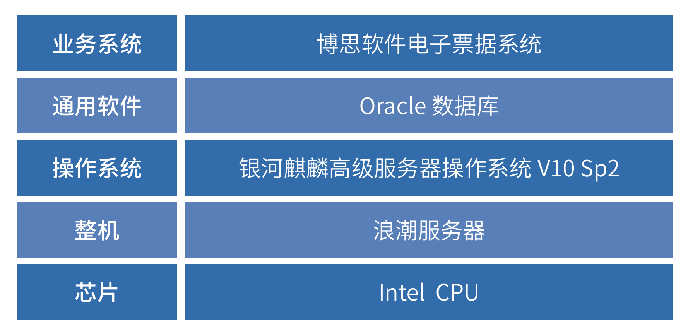

## 应用场景

医疗电子票据改革是财政电子票据改革的重中之重，具有很高的社会意义。财政部、国家医保局、国家卫健委于2019年要求
全面推行医疗收费电子票据改革，实现一站式医疗服务。2022年6月天津市卫健委下发CentOS停服应对指导意见，医院借
助此改革契机，为加强自身业务管理和网络安全，联合麒麟软件和博思软件，打造了国产操作系统支撑的电子票据系统。
需要对整体操作系统及业务系统进行适配改造，最终满足多样化通知取票渠道、全口径收入凭证电子化、财务精细化管理
及智能内控稽核、院内凭证全面电子化。
减少患者就医排队缴费时间，降低医院综合运营成本，提高了医院运行管理效率和服务质量升级改造后的国产化平台。
需要在稳定性、安全性、功能性、性能等方面满足业务运行条件。

## 解决方案

基于传统Intel硬件平台，搭配银河麒麟桌面操作系统
V10、Oracl 数据库，基于安全系统平台完成对博思电子票
据管理系统CentOS替代迁移适配验证工作，实现操作系
统的平滑迁移，保证了系统的高安全性、高可靠性、高性能。

 » 硬件平台：至强浪潮服务器(»Intel»X86)，3台自助打票机

 » 操作系统：银河麒麟高级服务器操作系统V10»SP2
 
 » 数据库：Oracle
 

## 客户价值

 » 安全稳定：该项目采用了银河麒麟操作系统V10为安全底座，从原有CentOS开源系统到银河麒麟高级服务器V10系统
平台后，同时系统搭载自研一体化安全机制，全方位保障系统和业务层面的安全，至今稳定运行，充分验证了银河麒麟
高级服务器V10系统平台承载客户业务系统的可行性和安全性。

 » 推广案例：目前天津市90%的三甲医院都采用博思软件的电子票据系统，且都部署在CentOS开源系统之上，存在重
大安全隐患，天津医科大学中医药二附属医院电子票据的实施部署成功，代表着银河麒麟高级服务器操作系统V10针对
CentOS 停服替代在电子票据系统上可以实现平替，并且可以实现批量推广。

## 伙伴

