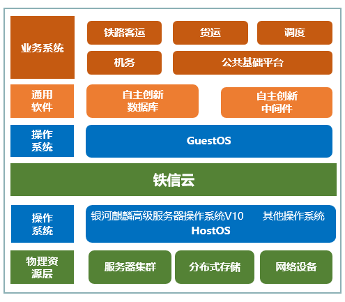

## 应用场景

铁信云作为铁路行业业务系统的重要基础设施，承接了大部分的业务和存储能力。后台的基础设施、操作系统、中间件、数据库等至关重要；银河麒麟操作系统V10作为铁信云和分布式存储的重要支撑部分，起到了重要的作用。

## 解决方案

-  基础硬件：服务器、存储、网络等物理设备；

-  网络平面：管理、业务、存储；

-  云平台：铁信云；

-  操作系统：银河麒麟高级服务器操作系统V10；

-  数据库：自主创新数据库；

-  中间件：自主创新中间件；

-  业务系统：铁路客运、货运、调度、机务、公共基础平台；

## 客户价值

战略目标：银河麒麟高级服务器操作系统V10作为云架构服务和分布式存储的安全底座系统，为行业应用、大数据、云计算和分布式存储系统提供支撑，保障了铁信云安全创新和铁路行业应用自主创新的重要战略目标。

## 伙伴

