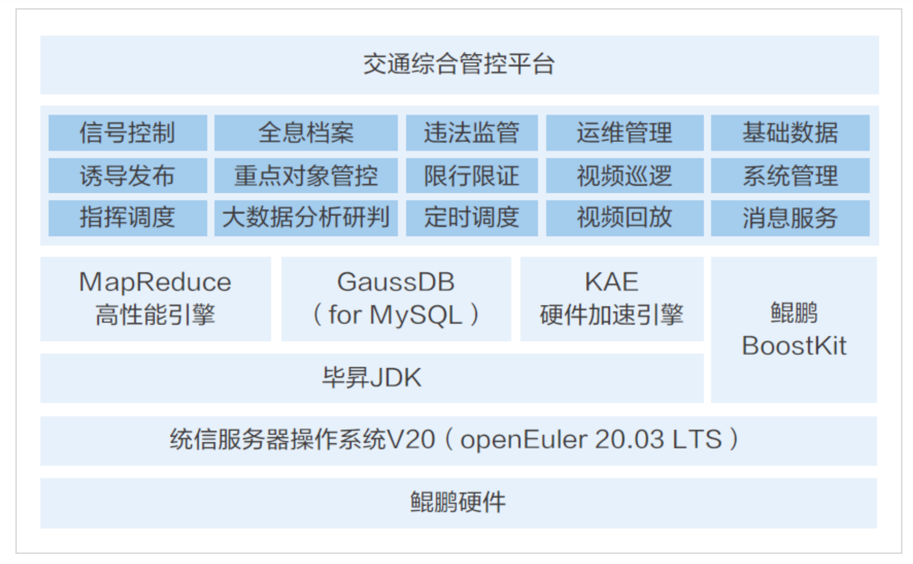

## 应用场景

随着城市化进程的加快，交通流量激增，武汉中科通达高新技术股份有限公司（以下简称“中科通达”）面临着提升交通管理效率和智能化水平的挑战，需要提供一个能够处理和分析海量交通数据的系统，以实现更智能、更精细的交通治理。

## 解决方案

中科通达开发的智慧交通综合管控平台，采用统信服务器操作系统v20(基于openEuler 20.03LTS的商业发行版)，充分利用了其稳定和安全的特性，结合云计算、大数据技术，实现了以下核心优势：

- 高性能计算: openEuler系操作系统提供了强大的计算能力，通过KAE硬件加速引擎，提升了数据处理速度和分析能力。

- 全栈优化: 使用鲲鹏应用使能套件BoostKit对系统进行全面性能调优，确保了平台的高效运行。

- 分布式存储与计算: 采用分布式GaussDB数据库和FusionInsight分布式计算引擎，提高了资源效率和数据安全性。

- 微服务架构: 通过微服务架构设计，实现了资源的高重复利用和快速产品迭代。

## 客户价值

1.性能显著提升: 基于openEuler系操作系统的管控平台，实现了模拟并发查询流量数据吞吐性能提升30%，页面加载时间大幅减少，优化了用户体验。

2.智能交通事件处理: 平台能够智能识别交通事件和违法行为，通过海量数据的并行计算，提高了交通管理的智能化和自动化水平。

3.数据共享与分发: 平台提供的接口与现网业务系统兼容，实现了数据的自由共享和

