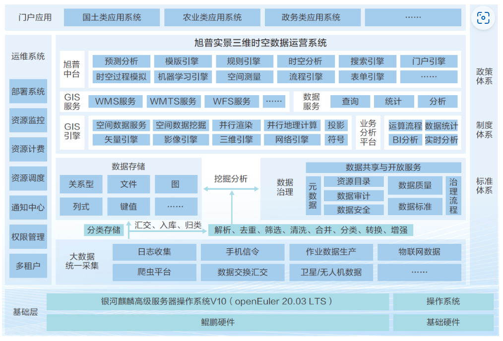

## 用户背景

旭普云智慧空间信息技术有限公司系普瑞时空信息产业发展集团成员企业，成立于2007年2月，主要为省、市、县各级政府以及自然资源、农业农村、住建、林业、生态环境、水利、交通等行业主管部门提供“时空大数据+”一站式全流程综合解决方案。

时空大数据治理中台是围绕地理信息数据的获取、加工、治理、编目、分析服务为一体的全链路解决方案，主要由时空云设施、时空数据存储、时空数据治理和时空数据应用组成，支持大规模矢量数据、时空三维模型、时空轨迹数据的存储计算，可用于查询分析、模式挖掘、轨迹聚类等分析场景，可广泛为智慧城市管理、自然资源管理、农业农村管理、地灾隐患识别等提供统一的平台支撑。

## 方案介绍

旭普实景三维时空数据运营系统是以地理信息技术为基础，结合实景三维、BIM、大数据集成等技术进行研发。平台以实景三维地理数据为底板，融合自然资源、政务数据、物联网、城市数据等多种数据，实现时空数据统一管理、分析与展现，是包括数据汇聚、融合、分析、共享等服务能力的全流程信息平台。为自然资源、智慧城市、农业农村等行业应用提供时空数据标准化资源体系、统一服务，实现数据集中管理、高效共享利用。 平台基于鲲鹏应用使能套件BoostKit、毕昇JDK、openEuler开源操作系统等进行全栈性能调优，性能得到全面优化，其中：三维数据加载渲染提高24. 7 5 %，多图层空间分析性能提升34.1 7 %、百万级矢量数据性能提升21.75%。

## 方案架构图

## 优势亮点

- 实现多源时空数据统一化归集、统一存储、统一治理、统一服务管理。

- 海量实景三维数据、矢量数据实现秒级加载渲染及高效服务。

- 三维数据加载渲染提高24. 7 5 %，多图层空间分析性能提升34.1 7 %、百万级矢量数据性能提升21.75%。

- 实现多级别、多业务的统一管理与服务，全面提升自然资源的综合监管能力、形势预判能力、态势感知能力、宏观决策能力。

## 伙伴

