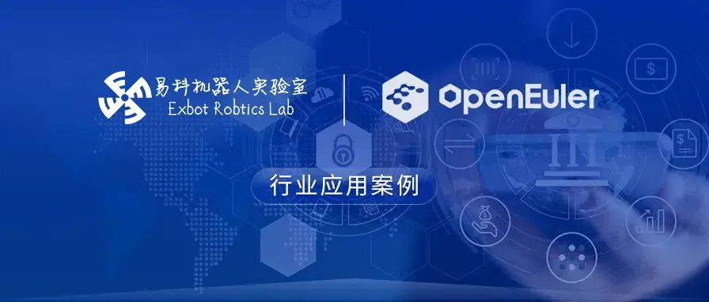
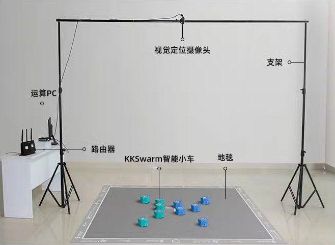
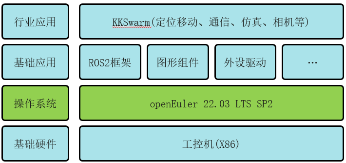

## 应用场景

易科实验室是由智能机器人开发者精英组建的开放、开源、协作组织，致力于机器人技术的创新与分享。社区通过知识分享以及进行团队协作，相互激发创造力。

其打造的开源集群机器人项目 KKSwarm，旨在为研究人员搭建一个高效、易用的集群研究平台。该平台适用于多车编队、集群算法的验证与开发，方案广泛应用于高校和院所。方案让研究人员能够快速上手，兼顾理论研究和工程落地之间的跨度。通过轻量级仿真环境，参数拟合让仿真和真实环境一致，使得仿真环境和真实环境高度匹配，从而快速在物理环境中验证算法，以达到工程落地的目的。

为了响应国家科技自主创新战略，加强信息安全建设，易科实验室和欧拉社区联系对 KKSwarm 平台进行操作系统改造，将原来部署在机器人平台工控机上的 Ubuntu 操作系统替换成基于欧拉社区的 openEuler Embedded 操作系统。

## 业务挑战

- 兼容性：在本项目之前，易科将多年运行的 ubuntu 系统替换为欧拉嵌入式系统，对于平台的稳定运行是个较大的挑战。这其中包含南向硬件、摄像头驱动等兼容。需要做好兼容适配稳定性的验证工作。

- 长期演进能力：KKSwarm 面临 ROS1(Robot Operating System)的生命周期即将到期的问题，在迁移操作系统的同时需要完成 ROS1 到 ROS2 的升级。相对于 ROS1 版本，ROS2 采用全新的架构，底层基于 DDS 通信机制，在实时性、嵌入式、分布式等方面改进大。因此操作系统对 ROS2 支持的完整度将影响 KKSwarm 的适配工作量和长期演进能力。

## 解决方案

KKSwarm 底层物理硬件采用 X86 芯片，操作系统采用 openEuler 22.03 版本。在兼容性方面，欧拉因本身基于原生的 Linux 内核。联合开发团队在做好预案、提前分析工作的同时，并在适配工作完成后进行了充分测试验证。使得机器人产品功能可靠性得到了必要且充分的验证。为新版本商用打下牢靠的质量基础。

openEuler 面向机器人领域解决了嵌入式 ROS 定制的高门槛问题、实现高自由度的分级实时应用。目前社区已经对 ROS2 完成 900+核心包、工具包、应用功能包等软件包的移植，包括 DDS 通信框架、RCL、导航、SLAM、RVIZ/RVIZ2 可视化工具、Gazebo 仿真工具等。因此在操作系统领域，openEuler 在 ROS2 的支持完整度方面处于领先地位。保障 KKSwarm 业务的长期演进。

## 客户价值

轻量化的 openEuler 嵌入式版本不仅镜像体积上得到优化、同时在实时性能方面相比之前系统也得到了提升。进一步增强了 KKSwarm 的产品竞争力。

