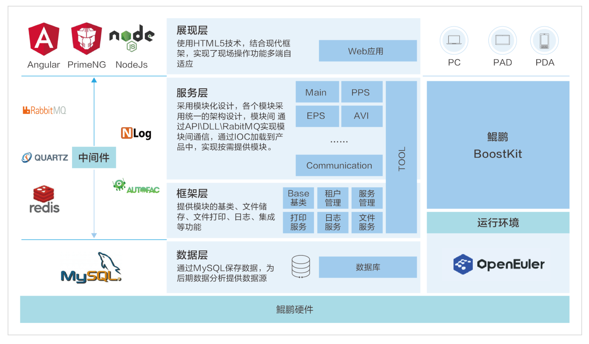

## 应用场景

在智能制造和工业自动化的背景下，供应链的协同效率对企业竞争力至关重要。依柯力信息科技（上海）股份有限公司推出的离散云MES系统，基于openEuler操作系统，为企业提供了一个高效、灵活的制造执行系统解决方案。

## 解决方案

依柯力离散云MES系统的解决方案特点如下：

- openEuler操作系统：系统采用openEuler作为其操作系统，利用其稳定性和安全性，为MES系统提供了坚实的运行基础。

- 性能优化：结合鲲鹏BoostKit，系统计算性能提升了50%，确保了数据处理的高效率。

- 数据存储与管理：使用MySQL作为数据存储解决方案，保证了数据的稳定性和可靠性。

- 中间件支持：采用RabbitMQ、Redis等中间件，增强了系统的消息传递和缓存能力。

- 多层架构：系统采用模块化设计，包括框架层、服务层和展现层，支持产线、工艺及功能的自由扩展。

## 客户价值

- 供应链协同：支持供应链上下游数据对接，显著提高了企业上下游的协同效率。

- 技术领先：系统经过大型先进工厂验证，集成了柔性生产、数字孪生、移动应用、射频识别等先进技术。

- 模块化设计：支持产线和工艺的灵活配置，便于企业根据自身需求进行扩展。

- 持续更新与支持：系统支持云端OTA升级，确保技术持续更新，同时提供订阅模式，降低企业投入风险。

该系统已经在科瑞信通用项目中得到应用，证明了其在提升生产效率和供应链协同方面的实际效果。

