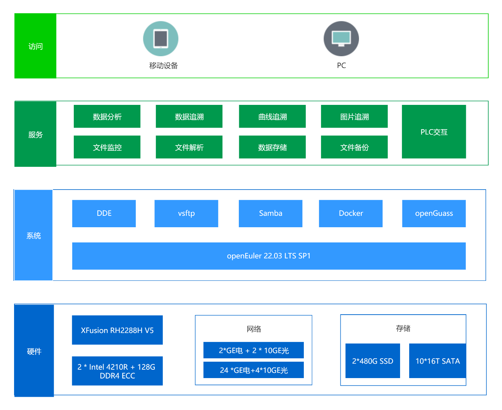

## 应用场景

银湖是专业的智能制造行业全场景MES系统数字化解决方案供应商，在统一平台上集成生产调度、产品跟踪、质量控制、设备监控、网络报表等管理功能，使用统一的数据库和网络联接，可以同时为生产部门、质检部门、工艺部门、物流部门等提供车间管理信息服务，帮助整车和零部件企业实现完整的闭环生产，协助企业建立一体化和实时化的MES信息体系，实现体验、效率、模式的创新及提升。

FusionMES.eCurve是面向车辆装备行业的专业的生产过程曲线管理系统。对生产过程中产生的拧紧、压装、气密、图像数据进行采集追溯分析，并支持异构系统对接用于质量门检查等。采用经过深度垂直集成和调优的高可用性FusionMES硬件系统，可根据产线规划事先完成预配置，整柜交付，现场开箱之后连网通电即可快速上线，是装配线曲线管理的理想选择。

## 产品特性

- 支持常见品牌的拧紧枪、压机、气密等曲线数据追溯。
- 支持其他类型设备的文件数据采集。
- 支持常见的工业相机图像追溯。
- 强大的曲线叠加和统计分析功能。
- 支持通过多协议与异构系统对接。
- 文件数据备份及定期自动清理。
- 硬件、电气改造、软件一站式交付。

## 解决方案

图1-1FusionMES.eCurve系统架构

- **硬件：** 系统硬件采用一台XFusion RH2288H V5服务器，配备2颗Intel 4210R CPU、128G DDR4 ECC内存、2*GE电+2*10GE光等4个网络接口、2*480G SSD硬盘+10*16T SATA硬盘。
还配备一台交换机，包含24个GE电口和4个10GE光口。
- **操作系统：** 操作系统采用openEuler22.03 LTS SP1。
主要应用的应用组件和服务包括：DDE、vsftp、Samba、Docker和openGuass数据库等。
- **服务：** 系统主要提供的服务包括：文件监控、文件解析、数据存储、文件备份、数据分析、数据追溯、曲线追溯和图片追溯等。同时还支持通过S7协议和西门子PLC进行交互。
- **访问：** 支持通过浏览器在已连接线网网络的PC端、移动端进行访问。同时用户也可以直接在服务器上通过浏览器进行系统运行状态监控、系统配置和数据追溯等操作。

## 客户价值

- **一体化交付：** FusionMES一体柜采用openEuler配合超聚变服务器一体化交付，适配性好、运行稳定。
- **I/O性能高：** 在产线节拍为30秒情况下，同时支持超过120台拧紧设备接入，I/O性能比其他系统提升约15%左右。
- **长期演进：** 基于国内最好的开源社区之一--openEuler开源社区，系统能保证有长期演进计划，用户可以基于openEuler做长期规划。

## 伙伴

