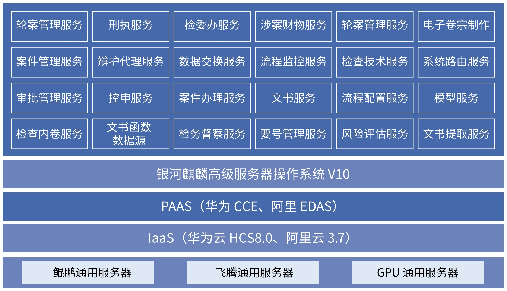

## 应用场景

过去，由于各部门系统不互通，公检法各部门均以自身独立办案系统进行运作，各单位、机构间的业务街接需投入众多人力、物力进行法律文书、案卷资料等的移送和交换，导致众多重复、繁琐的工作，带来人员和物资浪费。为了适应日新月异发展的信息技术和数据的日益增长以及检察业务的持续发展，在全面兼容统一业务应用系统 1.0 所积累的数据的基础上建设了易扩充性与易维护性的基于创新技术的统一业务2.0，包括操作系统、数据库、身份认证、电子印(签)章、域名跨网交换、协同办案、即时通讯等，同时满足系统运行所需的上下级部署节点之间的数据交换要求。

## 解决方案

- 基于 ARM 技术路线，银河麒麟高级服务器操作系统 V10作为云平台 Guest OS 支持业务系统运行。

- 结合鲲鹏 CPU 建立安全创新软硬件平台，适配多款新型GPU。

- 系统采用微服务架构、容器化部署。

## 客户价值

建设银河麒麟桌面操作系统V10 + 华为鲲鹏云桌面，提供安全创新、性能良好、稳定可靠的统一业务 2.0 软硬件运行环境。完成基础环境调试和业务系统迁移

## 合作伙伴

