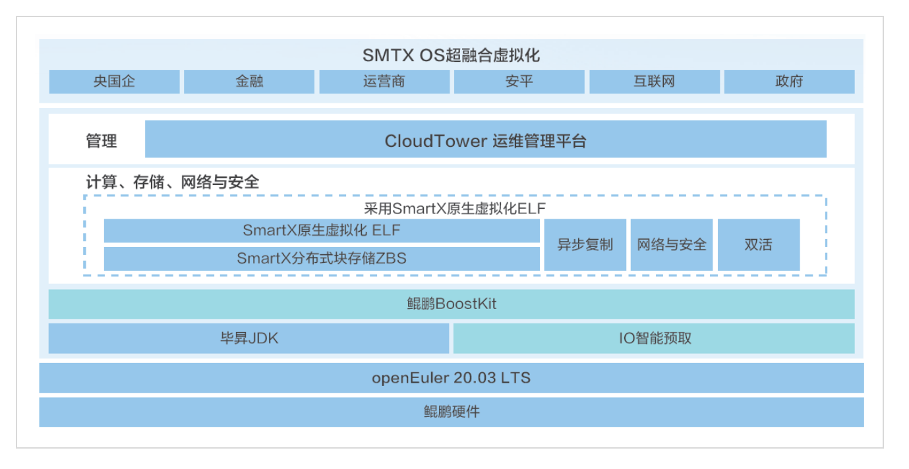

**应用背景**

北京志凌海纳科技有限公司（以下简称"志凌海纳"）致力于构建轻量、解耦、生产就绪的超融合云化基础设施。随着数字化转型的加速，公司寻求提升总体性能，同时确保系统的兼容性、稳定性、安全性、功耗、业务功能、基础性能和业务性能。志凌海纳采用openEuler操作系统，利用其调优特性，以实现性能提升和数据延迟降低。

**解决方案**

1.  **深度全栈优化**：志凌海纳联合北京鲲鹏生态创新中心，基于鲲鹏硬件、鲲鹏应用使能套件BoostKit、鲲鹏开发套件DevKit以及openEuler操作系统，对SMTX
    OS系统V5.0进行了深度全栈优化。

2.  **性能与稳定性测试**：针对openEuler操作系统，志凌海纳在兼容性、稳定性、安全、功耗、业务功能、基础性能和业务性能等7个维度进行了全面的测试验证，确保系统在生产环境中的可靠性。

3.  **自主创新与生态适配**：方案的核心组件完全自主开发，并与IT基础设施各层级生态厂商进行了充分适配，满足了自主创新的要求。

4.  **生产就绪与敏捷部署**：截至2022年7月，该方案已在20+大型金融客户的生产环境中落地，节点总数超过400个，支撑生产业务的同时，实现了基础架构的分布式云化转型。

**客户价值**

1.  **性能提升**：通过利用openEuler操作系统的调优特性，志凌海纳的SMTX
    OS系统V5.0在总体性能上提升了20%以上。

2.  **自主创新满足**：方案完全自主开发，与IT基础设施各层级生态厂商的适配，满足了自主创新的要求。

3.  **生产环境验证**：在20+大型金融客户的生产环境中成功落地，证明了方案的生产就绪性和可靠性。

4.  **敏捷与可扩展性**：三节点起步，按需投资，在线扩容，实现了基础架构的分布式云化转型，提高了业务的敏捷性和系统的可扩展性。

5.  **降低数据延迟**：通过优化，降低了数据延迟，提升了处理性能，为金融等行业的高速数据处理提供了强有力的支持。

6.  **客户案例实证**：中信建投证券作为生产级自主创新云平台的客户案例，实证了openEuler在实际业务中的应用效果和价值。
