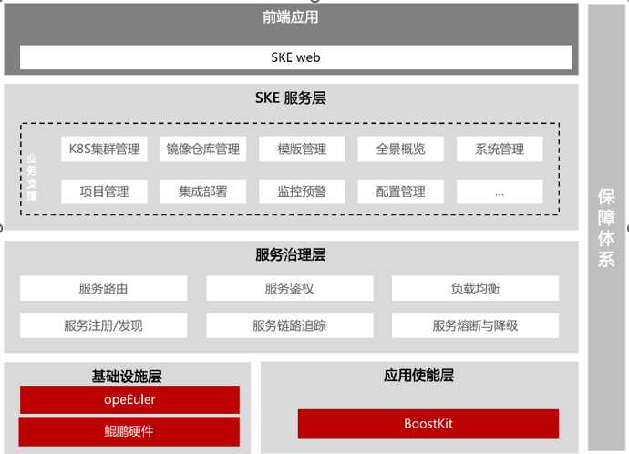

## 用户背景

四川中电启明星信息技术有限公司成立于1999年，本部设在成都，注册资金3.7亿元，人员规模1000余人，是国家规划布局内的重点软件企业。主要服务于能源企业和大中型集团。公司以云网大数据为依托，全面支撑新型电力系统建设，致力于成为国内领先的智慧能源平台型互联网企业

## 应用场景

云原生技术自2015年正式诞生以来，以种势不可挡的趋势迅速席卷全球的科技产业，并同时在互联网、金融、制造、零售等各行业遍地开花，推动了企业在数字化时代,实现以应用为中心的业务变革启明星容器云平台通过多年的建设,目前已在多个大型项目成功使用，拥有大量的成功案例。如国家电网中电启明星公司星云平台、国网中电启明星低代码平台、一体化统一权限平台、国网信产集团“思极云”等

## 解决方案

启明星容器云平台运行于openEuler操作系统之上，集成了isula或Docker容器运行时，并与Kubernetes无缝结合，构建了一个面向租户的serverless应用管理平台。借助DevOps和其他云原生技术，平台实现了资源的弹性伸缩、动态调度与高可用性，为用户提供了便捷的PaaS云服务。此外，平台自带的企业级应用商店开箱即用，大大减少了开发和部署的复杂性，从而提高了效率。为增强可观测性，平台还内置了多维度监控和统一日志管理功能，全面支持应用的生命周期管理。

## 客户价值

- **分布式调度：** 提供完整分布式调度能力，支持跨地域的多个资源池的统一调度和管理

- **弹性伸缩：** 可实时监控容器的关键性能指标，并根据调度策略进行实时运算，针对已过载的容器进行动态扩容

- **安全可控：** 支持创建并使用用户私有镜像，同时确保镜像的分享安全，团队的协作便利

- **性能优化：** 使得基于欧拉生态的容器云产品能够为客户提供更高效的运行环境，帮助客户提升业务处理能力，同时降低能源消耗，有助于降低运营成本

- **安全可控：** 使得基于欧拉生态的容器云产品能够为客户提供更高效的运行环境，帮助客户提升业务处理能力，同时降低能源消耗，有助于降低运营成本

- **生态协同：** 结合欧拉生态丰富软件资源和BoostKit应用使能，容器云产品能够为各类应用提供全面的支持。客户可以在同一生态中获取到所需的各类服务和支持，大大简化了IT开发和运维的复杂性。

- **创新驱动：** 信创和欧拉生态都是创新驱动的，持续推出新的技术和产品。客户可以通过使用容器云产品，获取到最新的技术成果，提升业务的竞争力。

## 伙伴

