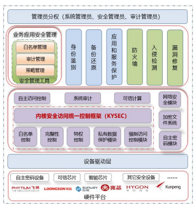

**应用背景**

自2023年起中邮信息科技（北京）有限公司与麒麟软件厂商开展面向寄递行业的服务器操作系统关键技术研究，搭建了基于"国产服务器+国产操作系统+国产数据库"架构的自主创新技术栈，并推动如智能客服、大数据平台、AI能力中心、CRM系统及AIOps智能运维等关键应用系统的自主适配改造，并于2024年9月实现约4000多套操作系统的切换上线，全面支撑到邮务、电商等多个业务板块及智能化运维等业务系统。

**解决方案**

基于银河麒麟高级服务器操作系统V10构建的云原生平台，针对中国邮政邮务、电商等板块业务对系统的安全性需求，银河麒麟操作系统通过自主软硬件、密码技术的内核与应用一体化的内生本质安全体系，自研内核安全执行控制机制
KYSEC、生物识别管理框架和安全管理工具，支持多策略融合的强制访问控制机制，并支持国密算法
SMx
和可信计算TCM/TPCM、TPM2.0等安全策略，为人工智能计算场景提供稳定、安全的运行环境。

云原生平台技术路线：

• 芯片：飞腾2500、飞腾5000c、鲲鹏920

• 硬件：ARM架构服务器

• 操作系统：银河麒麟高级服务器操作系统V10

• 基础软件：Kubernetes、Docker、Containerd等

• 应用软件：易捷云原生平台

**客户价值**

中邮信息科技（北京）有限公司在核心业务系统安全平稳运行和大数据平台、AI能力中心及AIOps智能运维系统等业务模块平滑迁移方面取得重大进展，不仅彰显了该公司在技术创新与自身业务融合方面的深厚实力，也充分验证了openEuler开源项目在实际行业应用中的成功运作成果。

**合作伙伴**

