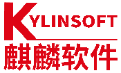

**应用背景**

中国海洋石油集团有限公司自2021年启动网信领域自主创新重点任务，成立专项工作小组，以"真替真用"的替代原则，组织全集团各级单位严格落实自主创新替代工作。为顺利推进国产操作系统在集团范围规模化的替代工作，专项工作小组联合麒麟软件等国产产品厂商，明确集团自主创新工作思路与推进流程，建立自主创新工作技术支持体系，并在实际工作中不断进行完善优化，最终形成了前期调研-方案设计-测试验证-实施上线-长期运维的全流程成熟高效的自主创新推进体系，实现了自主创新项目流程系统化、规范化，为自主创新工作在集团范围规模推进提供了坚实的基础。

**解决方案**

中国海油基于银河麒麟高级服务器操作系统与华为云等国产云平台、华为泰山鲲鹏服务器、东方通等国产中间件、人大金仓等国产数据库等基础软硬件完成全面的适配工作，为加油站管理、采办系统等业务系统构建夯实的基础运行环境。在此基础上，中国海油完成了银河麒麟高级服务器操作系统与业务系统、所需开源软件等业务层面的适配工作，最终实现全集团全栈自主创新。

{width="4.716666666666667in"
height="3.782638888888889in"}

**客户价值**

截止2024年，中国海洋石油集团有限公司已累积上线基于openeuler技术路线的银河麒麟高级服务器操作系统10000+套，在全集团服务器操作系统总量中已占超过80%的比重，验证了openeuler技术路线在央企集团规模应用实现自主创新的可行性，给能源行业自主创新工作树立了典范。

**合作伙伴**

{width="0.9357928696412948in"
height="0.47893153980752406in"}
