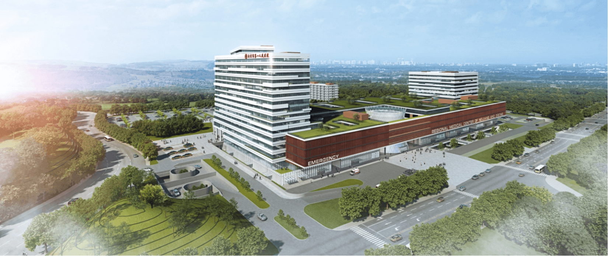
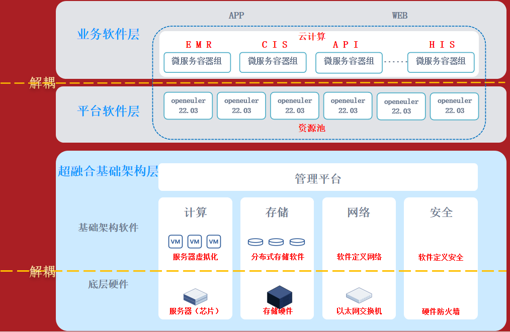
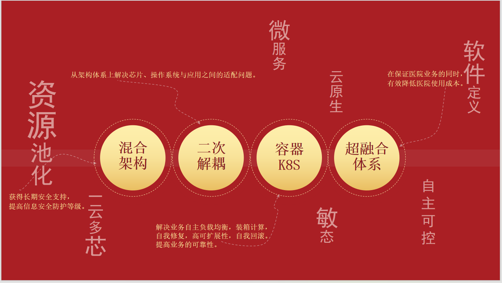

## 应用场景

近些年来，国外针对中国恶意隐瞒系统漏洞，纵容黑客窃取我国各种重要机密信息，极大威胁我国的基本信息安全。医疗行业作为信息安全的重要一环，更要加强安全保护。在信息化建设过程中，自贡市第一人民医院信息科团队面临着无限制规模化、资源超分浪费、运维复杂化等各种无法解决的问题，同时正值建设内自同城医疗中心的战略机遇，急需一套全体系数字底座支撑医院高质量发展。

自贡市第一人民医院信息科团队使用openEuler完成医院基础设施新数字化转型的升级替代，利用容器特性，完美承载医院核心业务升级改造，降低医院硬件投资的同时，完成对现有平台进行改造。利用海光x86+openEuler平台构建超融合构架资源平台，完成资源整合利用，完成全体系改造升级。

内自同城医疗中心

## 业务挑战

- 医疗业务应用系统缺乏相关软硬平台的适配测试。

- 医疗行业还没有形成完整成熟的产品生态·链

- 相关产品层级和产品众多，选择和搭配的工作量与难度较大

## 解决方案

自贡市第一人民医院基于自身医院信息化建设现状，结合实际应用进行目标体系设计。选择了先应用、后基础的两次解耦的模式进行升级改造的路线。即采用openEuler进行应用适配改造，以低成本完成操作系统的升级改造，然后从底层的计算、存储、网络等数据中心配套设施进行，从而完成体系的转型升级工作。

第一，依仗openEuler稳定性，安全性等优势，采用应用容器化，完成与openEuler之间的解耦，让应用拥有自己的文件系统、CPU、内存、进程空间，最大限度的减少与底层软硬件的关联，不依赖于特定的硬件配置和操作系统。能屏蔽底层异构基础设施的复杂性，能弱化对硬件辅助虚拟化技术依赖，能解放操作系统与软件的兼容适配。同时利用编排引擎，实现应用资源实时监控，动态的增减资源，减少人工干预，提高整个系统的高可用性。应用容器化的改造不仅要依靠应用厂家工程师，更需要医院的技术人员深入参与，完成对应用、微服务的细腻度改造。利用K8S编排引擎，结合细腻度改造，可以达到理想的改造效果。

第二，采用基于openEuler的超融合方案，完成硬件资源的解耦。从传统的FC-SAN交换机的技术转而使用IP网络，从传统数据中心到软件定义数据中心。通过软件实现计算、存储、网络等多种基础设施资源池化和服务化。实现从传统架构到分布式架构和软件定义数据中心的转型，简化了数据中心硬件的层次结构，落地容易，弹性很好，按需扩展，风险更低。

第三，采用海光x86芯片可有效降低项目难度；其次，CPU在虚拟化在实际运行中，互用率较高，实际资源占用率较低：第三，应用容器化后，占用大量资源的操作系统、组件、杀毒软件等多余资源占用大幅下降，再次降低CPU负载；最后，采用以核心数量换取综合性能的方式获得同样的性能，最终完成CPU的适配与替换。

目前，自贡市第一人民医院已完成部分核心业务容器化改造适配工作，均采用openEuler 22.03 LTSC作为云计算基础操作系统，利用Kubenets（简称k8s）容器编排引擎，实现实例的自我负载均衡、自动化部署、自我修复、高可扩展性等优势。部署有19台虚拟机服务器承载整个业务系统，其中3台服务器搭建高可用管理集群，若干节点作为应用实例承载。最明显的优点凸显于在业务高峰期，早上8点-12点，下午1点-5点，业务实例自动扩展，业务回落自动回收资源，同时，备份、报表实例开始扩展，实现弹性伸缩，资源互用，有效节约医院硬件资源投资。截至2023年12月，整套系统已经平稳运行200余天。

## 客户价值

目前医疗行业升级替换进度较为缓慢，同时多数方案仅停留在于办公管理等应用，在核心业务上都还没有一套成熟度较高的方案。我们这套采用openEuler+容器化的方案，不仅可以较低的投资完成相关工作，同时采用应用容器化的方式，实现了核心的业务架构的升级替换工作，有效解决目前普遍存在与医疗行业的资源超分浪费、无限制规模化建设的问题。具备下图上几点特点：

可以说此方案不仅是升级替换，而是一整套医疗系统改造升级方案。