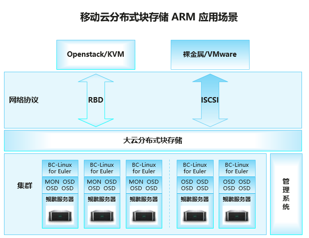

# 应用场景

移动云是中国移动面向政企、事业单位、开发者等客户推出的基于云计算技术、采用互联网模式、提供基础资源、平台能力、软件应用等服务的业务。移动云是建立在中国移动"大云"的基础上，自主技术研发而成的公有云平台，通过服务器虚拟化、对象存储、网络安全能力自动化、资源动态调度等技术，将计算、存储、网络、安全、大数据、开放云市场等作为服务提供，客户根据其应用的需要可以按需使用、按使用付费。

BC-Linux 针对移动云业务应用场景，对 openEuler
进行了深度定制和优化，新增核心组件热升级、虚拟化及容器特性增强、系统安全加固、DPDK
加速库、集中部署运维工具等特色功能，集成 KAE
插件，软硬协同完成从应用到系统全堆栈的性能优化，充分释放多样性算力。

# 解决方案

-   操作系统采用 openEuler LTS 20.03 SP1 ，硬件采用 TaiShan 200
    服务器作为算力底座

-   在分布式块存储场景下，通过对 CPU、内存、网络三个子系统进行 openEuler
    深度调优，充分发挥出鲲鹏服务器低成本、低功耗、高性能的优点

# 客户价值

-   自 2020 年起，BC-Linux ARM 版已在移动云块存储集群部署 380 套，为
    60PB（裸容量）存储数据服务提供良好支撑，并稳定运行至今；
-   同等配置条件下，鲲鹏服务器随机读写性能优于 x86 服务器，随机读 IOPS提升 100%，时延降低 30%；

# 伙伴

