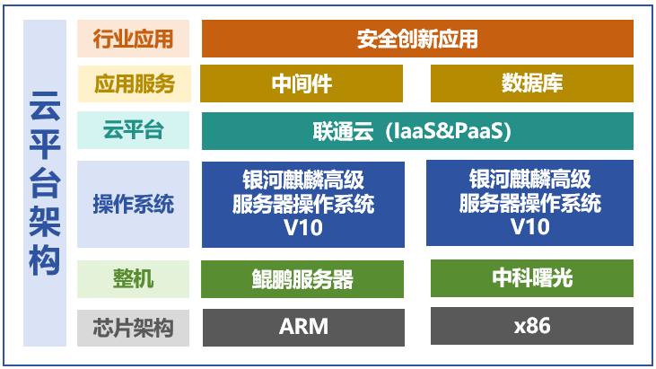

## 应用场景

联通云基于“双引擎基座+一云多芯”为不同行业场景提供可靠、高质量的应用上云服务。在核心代码进行了全面把控，定制多架构芯片应用适配模版，开发了计算、存储、网络、中间件等组件，全面适配自主化服务器和操作系统，提供云服务器、云硬盘、裸金属、负载均衡、虚拟私有云等多个 IaaS 和 PaaS 产品，为致力于信息化生态建设适配了多家软件，完美契合对行业需求。

## 解决方案

基于 “X86+ARM+OpenPower”三架构混合部署，核心基础硬件适配鲲鹏、海光等主流芯片，操作系统选用银河麒麟操作系统，向上支撑数据库、中间件与应用软件，构建云平台架构。

## 客户价值

-   适配问题：解决银河麒麟高级服务器操作系统 V10 适配 OpenStack S 版缺少依赖包的问题。

-   项目价值：银河麒麟高级服务器操作系统 V10 与联通云各版本保持一致的认证要求，通过麒麟软件认证测试。

未来，麒麟软件将持续加快数字化自主创新进程，以科技自立自强促进数字经济新发展，服务运营商高质量发展，赋能政企千行百业。

## 伙伴

