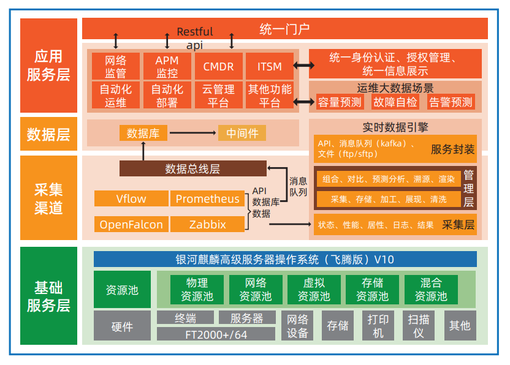

## 应用场景

智能运营平台，是联通系统集成公司基于数十年丰富的 IT 运营管理经验，依托自主研发能力构建的一体化、全生命周期的智能 运营工具链。该项目主要覆盖了智能运营平台的 5 大子平台：智能监控平台、CMDB 配置管理平台、自动化运维平台、ITOM 运维服务管理平台、运维大数据分析平台。

## 解决方案

采用飞腾服务器 + 银河麒麟高级服务器操作系统 V10 的 技术路线，适配自主创新数据库、中间件、外设及网络存 储设备，结合云平台实现资源虚拟化，构建全栈自主创新 的基础设施服务层，来构建联通智能化运营平台。

## 客户价值

生态完善：智能运营平台完成与自主创新环境的适配，并稳定运行标志着智能运营平台与自主创新的环境的兼容性，避免了 高额的运维成本。 • 行业案例：智能运营平台 V2.0 通过 NeoCertify 测试的各项内容，能够满足银河麒麟高级服务器操作系统（飞腾版）V10 和 智能运营平台 V2.0 的认证要求，通过麒麟软件认证测试。

## 伙伴

