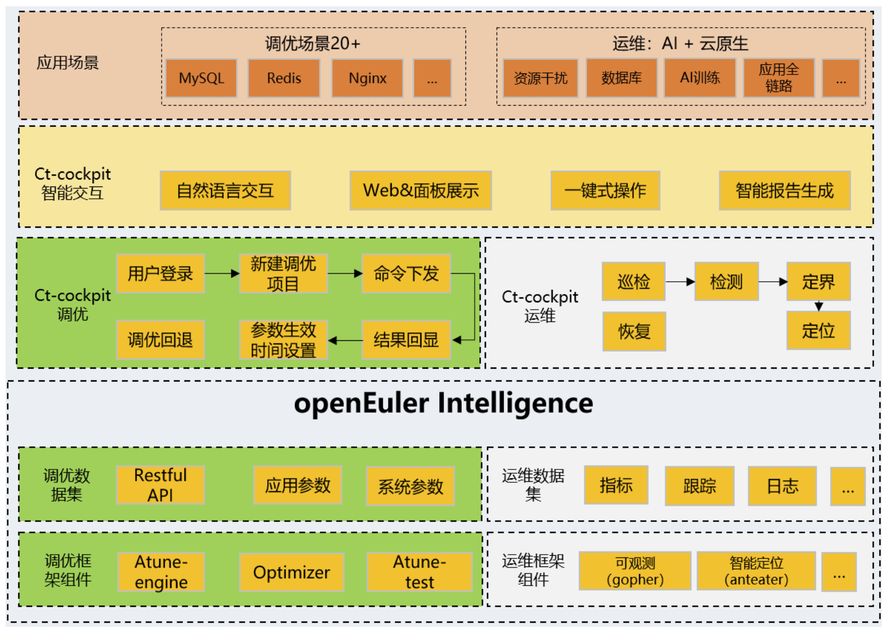

## 应用场景

-   操作系统数量多：当前centos全网替换7w+套， CTyunOS累计替换率约80%，全国各省累计实现落地10W+，覆盖全国各省电信、政企、金融业务，承载用户量估计超过120W。

-   业务规模大：同时涉及IPTV、智慧领域、智慧城市、渠道工作中心、采购平台、销售支持中心等数百种类业务，带来海量调优的运维压力，迫切需要建立智能调优系统，满足海量调优的诉求。

-   场景变化多：通算云大数存四大不同的业务场景， 各场景之间的软硬件差别较大。

## 业务挑战

-   业务调优人力不足：软件规模剧增，当前系统软件可调参数已达13000+，远超出人工调优能力范围。

-   应用负载变化较大：闲时忙时的业务切换，在线业务和离线业务的混合部署。

-   专家经验难以固化：系统复杂带来调优经验难以固化。

-   调优效率效率较低：调优时长天级甚至周级。

## 解决方案

电信天翼云基于openEuler自研的操作系统CTyunOS，能够支撑天翼云所有应用场景，在电信、国资央企、政务等行业实现大规模生产环境部署，经历海量真实云业务场景长期打磨验证，满足关键行业对于操作系统的企业级稳定性要求和国产化替代要求。中国电信天翼云自主开发了虚拟化增强组件、云平台组件、编译器工具链和开发环境等，是针对云计算场景进行深度优化的定制增强版。

CTyunOS充分融入了openEuler社区的优势，针对性能调优需求，基于openEuler Intelligence构建智能调优负载感知与自主调优技术，通算四大主力场景性能提升10%。

## 客户价值

1、集成至ct-cockpit，提供图形化前端界面，进行性能优化，通算云/大/数/存场景性能提升10%。

2、上架翼智平台应用，提供RPM包+用户文档供参考，方便用户快速使用智能调优能力，调优效率天到小时级。

# 合作伙伴

