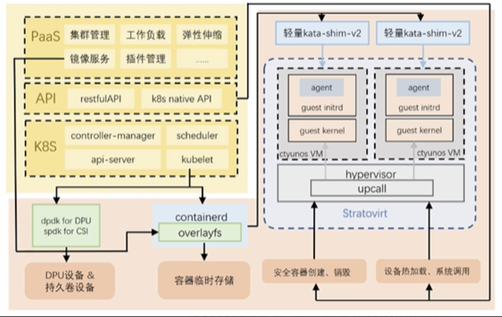

## 应用场景

函数计算FaaS的目标是为用户提供基于事件驱动的全托管计算服务，用户无需采购、管理任何基础实施和后端服务，只需聚焦于编写代码或应用镜像，而计算资源、编排调度、服务发现、可观测性等全部由函数计算平台提供。

## 业务挑战

在函数计算架构中，多租户隔离、安全沙箱、冷启动、轻量虚机、内存底噪是至为关键的因素，因为这些要素决定了用户体验和平台的投入成本，最终也决定了FaaS的产品竞争力

## 解决方案

-   基于openEuler 22.03 LTS SP1完成microVM镜像极致轻量的定制化裁剪，实现在X86上支持拉起Xk+pod的目标

-   凭借StratoVirt原生轻量化架构的优势，打造基于Nydus的虚机快照方案，提升轻量虚机启动速度&容器镜像加载速度XX%。

## 客户价值

基于stratovirt的安全容器能够为函数计算提供完善的租户隔离和安全运行环境，并且在内存底噪、启动速度、并发、密度上都有很好的优势，提升天翼云FaaS产品竞争力

