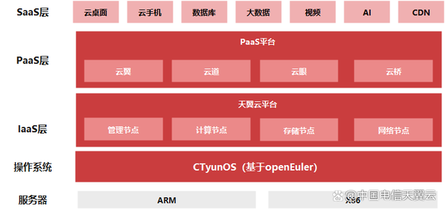

## 应用场景

中国电信天翼云于2021年发布基于openEuler的自研操作系统CTyunOS。截至2022年8月，CTyunOS已完成天翼云公有云平台全业务适配，通过提供完整的迁移工具体系和工程能力，使天翼云全场景业务无缝替换到CTyunOS，累计上线3万套，有效支撑中国电信“云改数转”的战略落地。

当前，CTyunOS已经适配天翼云IaaS层云平台计算节点、存储节点、网络节点、管理节点，PaaS层的云翼、云道、云桥平台，上层的ECX、数据库等业务，平台性能提升10%以上。

## 解决方案

天翼云CTyunOS提供了完备的迁移方案，包括成立迁移保障组织、迁移分析、方案设计、移植适配、搬迁实施和测试上线六个阶段，同时借助x2openEuler迁移评估和原地升级技术，实现了全场景业务的“简单、平稳、高效”的替换。

- 通过x2openEuler迁移评估技术，对软件、硬件、配置的兼容性情况给出全方位的分析。具体包括OS迁移前后，上层业务软件接口上的变化、依赖软件包版本的变化，操作系统配置参数的变化等，保证业务的平滑迁移。

- 通过x2openEuler的原地升级技术，一键式将存量CentOS升级到CTyunOS，升级前后上层业务无需重新部署，参数无需重新配置，大大降低了升级时长。同时整个升级过程可以直接使用原有服务器资源，无需额外准备备用机，大大节省了迁移成本。原地升级技术将单节点的升级时长控制在2小时以内，最大程度的减少升级对业务的影响。

## 客户价值

截至目前，天翼云CTyunOS 已在公有云内蒙古节点、一城一池、IT上云等资源池完成了规模迁移3万套，服务天翼云千行百业客户。

未来，中国电信天翼云也将继续携手openEuler，共同完善CTyunOS操作系统，提升系统的可靠性及可用性，不断推进CTyunOS版本的持续更新和完善。同时，双方携手加强科技创新和关键核心技术攻关，共铸天翼云坚实数字底座，助力行业客户的数字化转型，推动中国数字经济高质量发展。

