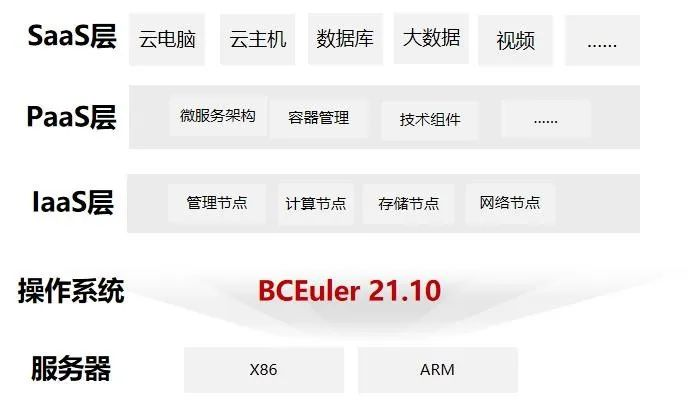

## 应用场景

中移苏州研究院主要面向政企、事业单位、开发者等客户推出基于云计算技术、采用互联网模式、提供基础资源、平台能力、软件应用等服务的业务。自建云是建立在集团“大云”的基础上，自主技术研发而成的公有云平台，通过服务器虚拟化、对象存储、网络安全能力自动化、资源动态调度等技术，将计算、存储、网络、安全、大数据、开放云市场等作为服务提供，客户根据其应用的需要可以按需使用、按使用付费。

中移苏州研究院服务器上承载着各行业客户的生产业务系统，之前操作系统采用自研的BCLinux for CentOS，一旦业务系统因国外操作系统停止维护而出现重大安全漏洞隐患，将可能面临关键信息泄露、实时数据服务中断等风险，急需将操作系统替换成以openEuler为根社区的国产操作系统。

## 解决方案

- 操作系统采用BCLinux for Euler 21.10，基于openEuler 20.03 LTS SP3自研，服务器采用X86、ARM架构。

- 联合麒麟信安等服务商，完成与BCLinux for Euler 21.10操作系统的适配验证、搬迁实施等。

- 对迁移工具的持续优化打磨，形成了数据备份-操作系统重装-数据回迁-业务上线的自动化流水线作业。

## 客户价值

- 已完成上万台资源池节点服务器从原有操作系统到BCLinux for Euler 21.10切换的可行性验证及迁移改造上线，做到了迁移过程业务不中断，同时也保障了迁移前后数据的完整性和一致性。

- 避免了国外操作系统停止维护后对客户业务系统的影响，保障了操作系统的长期支持服务。

- 增强和优化了系统内核性能、虚拟化模块、系统安全等功能模块，提升了系统整体性能，保障了系统的稳定性和安全性。

- 麒麟信安提供以openEuler为技术核心的支撑服务，推动电信行业向openEuler系操作系统的平滑演进，助力客户数字基础设施底座的国产化建设。 

## 合作伙伴

