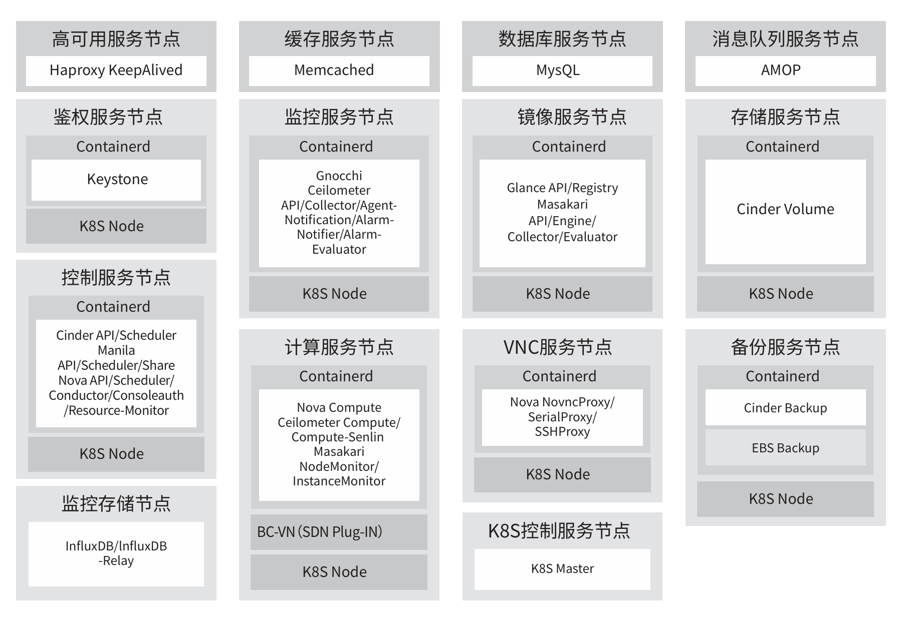

## 应用场景

中国移动云能力中心“混元”分布式计算系统是移动云自主研发的新一代算力管控系统，依托3AZ高可靠布局，采用一云
多芯、多元异构分布式云原生架构，集软硬一体虚拟化“零”损耗云化加速技术，构建千万核算力接入，秒级智能调度，
数百种规格弹性交付能力。
中国移动云能力中心基于混元架构打造的云主机产品为政务、医疗、教育、交通、文旅等千行百业的数字化转型需求提供
灵活弹性、稳定可靠、安全可控、性能强劲的多样泛在算力，以优质、高可用的算力服务，为客户带来上云新选择，实现“算
力升级、智能升级”。中国移动云能力中心的天元“易行”迁移解决方案，可以帮助已有的业务系统实现无缝迁移，保证
业务的稳定性和高可用性。

## 解决方案

移动云云主机操作系统迁移方案，支
持由BC-Linux/RHEL/CentOS»7 平滑
迁 移 至BC-Linux»for»Euler»21.10。
通过与openEuler 社区联合打造运
营商云主机领域行业级高效安全的迁
移解决方案，已为移动集团内部迁移
操作系统超过8万套，为CentOS迁
移路线树立了优秀标杆。其中虚拟机
热迁移能力是中国移动云能力中心与
openEuler 社区开展联合创新，完善
了虚拟化热迁移能力，提升热迁移效
率30%，迁移成功率达到了95%以上。

## 客户价值

 » 移动云现网20000+台云主机宿主机，实现端到端的业务无感迁移。

 » 虚拟化热迁移联创，减少迁移时长30%+，迁移过程中虚机陷入陷出开销减少25%+。

