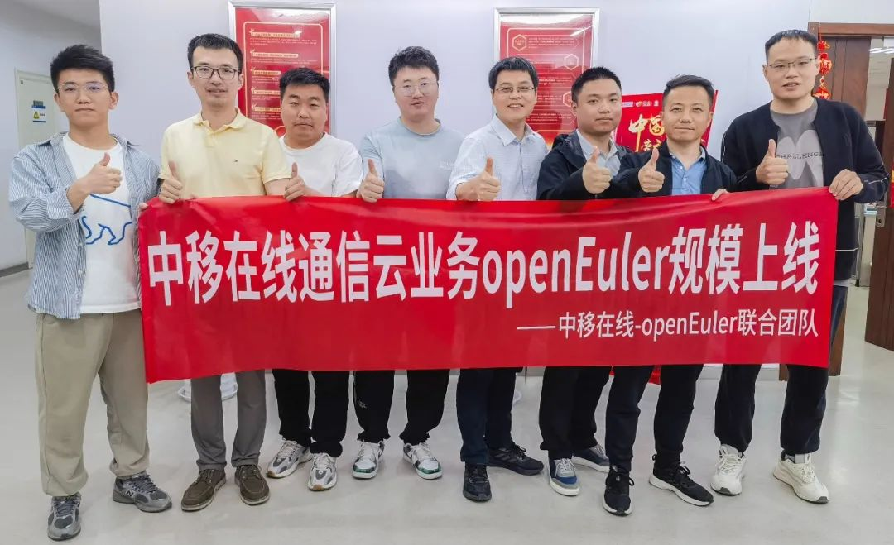

历时两天，总计六个小时，中国移动在线营销服务中心（简称中移在线）正式启动内部核心业务系统全网呼叫平台的迁移工作。首批1050套操作系统完成从 CentOS（系统版本7.2、7.4和7.6）到 openEuler 高效平滑迁移。中移在线拥有全球最大的呼叫平台，采用"中心+边缘"的部署架构，按照"控制集中，媒体分散"思路进行部署，包括洛阳淮安中心机房以及31分中心机房，7000+裸金属及虚拟机，本次迁移工作涉及 17 个分中心，1000+业务实例。本次迁移中，首次使用openEuler"三热"特性（内核热补丁、内核热替换、操作系统热升级），整个迁移过程平稳高效，迁移进度可视化，业务零中断，用户无感知。中移在线已完成近3万套操作系统迁移，伴随着核心业务系统的迁移工作正式启动，预计到今年年底，将加速完成超过7万套迁移工作。

5月24日-25日，历时两天，总计6小时，中移在线成功将内部业务的1050套（物理机、虚拟机）操作系统从 CentOS（系统版本包括7.2、7.4和7.6）高效平滑迁移到 openEuler 20.03 LTS SP3。本次迁移涉及的核心业务为中移在线全网呼叫平台业务 17 个分中心，总计约 20 个业务子系统，1000+业务实例，是全球最大的呼叫平台。整个迁移过程总计六小时。迁移后各项业务系统运行效率更加高效，运行状态更加平稳，系统运维更加容易。本次操作系统迁移的顺利完成，为电信行业的操作系统迁移树立了标杆，为中移在线的其他业务的操作系统迁移积累了经验，为 openEuler 社区 CentOS 迁移技术路线和迁移工具提供了优秀的样板案例，为有 CentOS 迁移需求的企业提供了一个新选择。

openEuler"三热"特性（内核热补丁、内核热替换、操作系统热升级）首次规模商用。一条命令完成内核漏洞修复、内核升级、操作系统热升级，整个迁移过程平稳高效，迁移进度可视化，业务零中断，用户无感知。

近年来，CentOS 停服让所有企业都在思考操作系统迁移的问题。中国移动作为 openEuler 委员会的捐赠人，很早就与 openEuler 社区研究 CentOS 停服的解决方案。在中移在线与 openEuler 社区的共同努力下，提供了一套完整的操作系统迁移技术路线，为了确保操作系统迁移自动化，迁移流程专业化和标准化，openEuler 社区发布 x2openEuler 迁移工具，本次中移在线在使用的就是这套方案。本次中移在线操作系统高效平滑完成迁移充分验证了 openEuler 社区 CentOS 迁移技术路线和迁移工具的可行性、稳定性和可靠性。

下一步，openEuler 社区充分发挥开源社区的优势，持续发展和升级openEuler 社区的CentOS迁移技术路线和迁移工具，助力更多企业完成 CentOS 操作系统高效平滑迁移。

