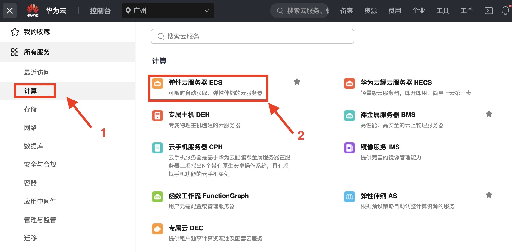
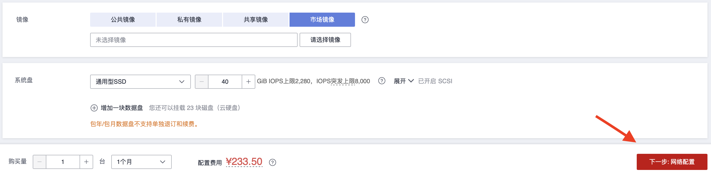
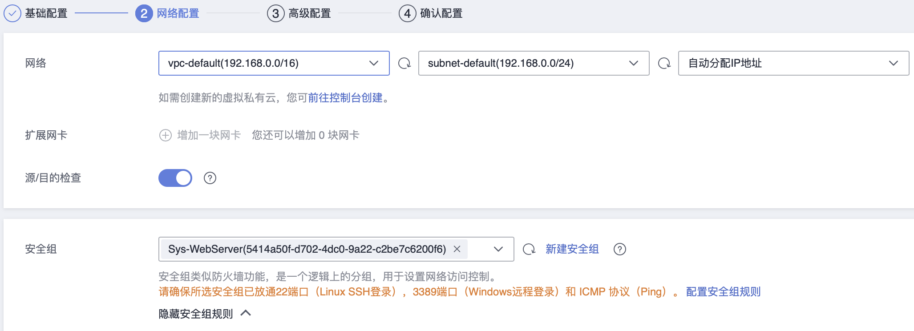

# 安装使用

openEuler 社区版分为长期支持版本（LTS）和创新版本，并提供多种环境以便开发者[下载使用](https://www.openeuler.org/zh/download/get-os/)。

## 1. 公有云上 openEuler 镜像使用指南

目前，社区已经将多个版本的 openEuler 云镜像发布到公有云厂商以方便用户使用 openEuler。

### 1. 1 可用版本

以下是主流公有云上已发布的 openEuler 镜像版本：

- **AWS Marketplace**

| Version         | AMI ID                | Arch    |
| :-------------- | :-------------------- | :------ |
| 22.03-LTS-SP1 2 | ami-0baeb9308b134d488 | x86_64  |
| 22.03-LTS-SP1   | ami-03231b47c646ab173 | aarch64 |
| 22.03-LTS-SP2   | ami-0eceb9e642c0299f8 | x86_64  |
| 22.03-LTS-SP2   | ami-067e1b0f491b95db2 | aarch64 |
| 22.03-LTS-SP3   | ami-0145435b3931b0fe7 | x86_64  |
| 22.03-LTS-SP3   | ami-01677a5af1dee0f72 | aarch64 |
| 23.09           | ami-08556c9d0dd2f0a01 | x86_64  |
| 23.09           | ami-051484777fe029d4e | aarch64 |

- **华为云商店**

| Version         | Arch    |
| :-------------- | :------ |
| 22.03-LTS-SP2 1 | x86_64  |
| 22.03-LTS-SP2   | aarch64 |
| 22.03-LTS-SP3   | x86_64  |
| 22.03-LTS-SP3   | aarch64 |
| 23.09           | x86_64  |
| 23.09           | aarch64 |

注意，腾讯云还未大规模使用arm算力，发布时国内很多区不可用，因此未在腾讯云上发布openEuler的arm镜像。

### 1.2 创建openEuler云实例

以在华为云上创建云主机（实例）为例，说明公有云上openEuler的使用方法

 - 登陆华为云并进入控制台

  

 - 选择弹性云服务器ECS

  
  

 - 购买弹性云服务器并配置

  

  1. 配置算力资源

  


  2. 选择openEuler镜像

  
  
  


  3. 进行网络配置

  
  

  4. 设置登录方式
 
  
  
 **需要注意华为云商店要求发布的镜像禁止root用户登录** ，因此这里设置的root用户仅限于控制台登录，如果用户需要使用root权限，则可通过控制台登入后修改`/etc/ssh/sshd_config`文件进行配置。

  5. 完成购买

  

  6. 登录使用

  等待创建的云主机状态变成运行中即可进行远程登录。

  
  
由于华为云商店发布镜像的要求，openEuler镜像启动的主机 **禁止以root用户登录、禁止使用密码认证** ，其默认用户为openeuler。
因此，主机在正常使用之前需要通过步骤4设置的root用户在控制台登录修改`/etc/ssh/sshd_config`文件的配置项以满足要求，具体配置如下：


```
# /etc/ssh/sshd_config

# 允许以root用户登录
PermitRootLogin yes
# 允许使用密码认证登录
PasswordAuthentication yes
```

修改完成后即可在任意终端使用ssh以root用户密码登录：


```
$ ssh root@1.92.159.107

  Authorized users only. All activities may be monitored and reported.
  root@1.92.159.107's password: 

  Authorized users only. All activities may be monitored and reported.
  Last login: Mon Apr 29 11:03:05 2024


  Welcome to 5.10.0-182.0.0.95.oe2203sp3.x86_64

  System information as of time: 	2024年 04月 29日 星期一 11:19:11 UTC

  System load: 	0.00
  Processes: 	80
  Memory used: 	3.7%
  Swap used: 	0.0%
  Usage On: 	4%
  IP address: 	192.168.0.231
  Users online: 	2

 [root@openeuler-host ~]# 
```

其他云上openEuler镜像的使用方式与华为云相似，详细使用方法可参考对应云上商品的使用指南。

### 1.3 Hello World

至此，创建的openEuler云主机已经可以进行开发活动，让我们一起写出openEuler上的第一个Hello World'


```
# hello_world.py
print("Hello, world!")
```

使用python3运行


```
[root@openeuler-host ~]# python3 hello_world.py 
Hello, World!
```

